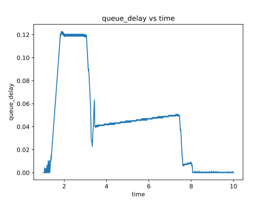
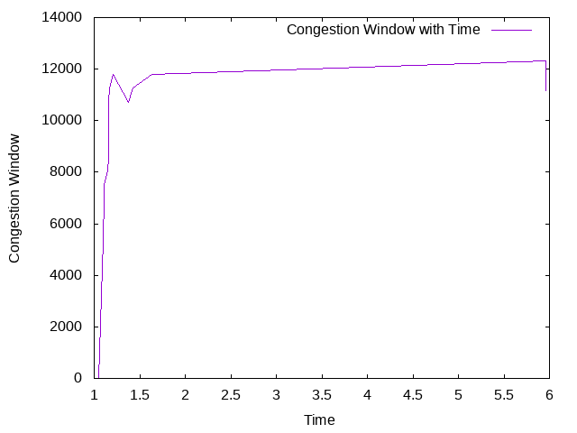

## Nirbhay Sharma (B19CSE114)
## Computer Networks - Lab 3

---
### **Readme**

- general workflow for solving the questions
    - for finding throughput we can go to conversations and then to tcp column there we can find the throughput
    - for experiments related stuff, we can change the values in tcp file and then run/simulate the file using waf, using command
    - > ./waf --run scratch/tcp-example-updated.cc
    - for finding the tcp queue_size vs time and queue_dealy vs time curve we can use scripts attached at the end of the file to run them simply type on terminal
    - > python3 script.py

---
### **Results of simulation**

### **Exploring tcp-example-1-0.pcap**

**que1**


*part1*
- avg throughput - $3864$ Kbits/sec 
- max throughput (bandwidth) - $5000$ Kbits/sec (min(bandwidth1, bandwidth2))
- No, average throughput is not same as maximum throughput
- possible reason could be dealys in the network which includes queueing delay and also congestion in the network since queuesize is small (10p) which also affects throughput 

*part2*
- congestion window size has been reduced $4$ times throughout the process

**que2**


*part1*
- avg throughput - $3874$ Kbits/sec
- max throughput - $5000$ Kbits/sec
- No, average throughput is not same as maximum throughput
- possible reason could be dealys in the network which includes queueing delay and also congestion in the network since queuesize is small (10p) which also affects throughput 

*part2*
- with increasing queue_size and bandwidth1 the average throughput will become close to maximum here are some simulated results-

|parameters|avg throughput|
|---|---|
|bandwidth1 = 90M|$3876$ K|
|bandwidth1 = 90M, queue_sz = 100p|$4364$ K|


**que3**


*part1*
- avg throughput - $2753$ Kbits/sec
- max throughput - $5000$ Kbits/sec
- No, average throughput is not same as maximum throughput
- possible reason could be dealys in the network which includes queueing delay and also congestion in the network since queuesize is small (10p) which also affects throughput 

*part2*

|parameters|avg throughput|
|---|---|
|delay1 = 5ms, queue_size=100p|$4436$|
|delay1=5ms, queue_size=1000p|$4457$|

observation- reducing dealy and increasing queue_size will increase the average throughput and on the other hand if we increase the delay while keeping queue_size high, we get low throughput as compared to shown in table.

**que4**


*part1*

- avg throughput - $4381$ Kbits/sec
- max throughput - $5000$ Kbits/sec
- queue_size vs time $\\&$ queue_delay vs time (for queue len = $1000$ p) for node1

<span>  </span>

- queue_size vs time $\\&$ queue_delay vs time (for queue len = $10$ p) for node1

<span>  </span>

- as we are increasing the queue_size, the throughput is also increasing and also shown in above queue_size vs time curve that if queue_size is low then enqueue and dequeue will occur very fast and hence we are getting curve like <a href='#10pnode1'>queue_size_node1</a> which has lots of up and downs and if queue size is larger ($1000$ p) then we will have smoother curve like <a href='#1000pnode1'>queue_size_node1</a> 

*part2*

|queue_size|avg throughput|
|---|---|
|$\leq 200$|$4339$|
|$\gt 201$|$4381$|

various values have been tried (values = 200,300,700,100,150,125) to obtain the optimal queue_size and it is observed that if queue_size is less than 200 then throuhput is 4339 and any value greater than 201 will be saturating to 4381
and hence $201$ is the optimal queue_size


**que5**

*for TcpCubic*


- avg throughput - $4166$ Kbits/sec
- max throughput - $5000$ Kbits/sec

*for TcpVegas*



- avg throughput - $1806$ Kbits/sec
- max throughput - $5000$ Kbits/sec

*part1*

The difference in tcp throughput is in the order $Th_{cubic} > Th_{reno} > Th_{vegas}$

*part2*

- **for tcp reno**:
    - one can observe that for tcp reno the congestion window reduces 4 times
    - so during slow start phase it grows linearly and then it encounters congestion so to avoid congestion it applies multiplicative decrease and since it changes cwnd 4 times it means it has to face congestion 4 times. 
- **for tcp cubic**:
    - one can observe that for tcp cubic the congestion window reduces 5 times 
    - it starts linearly in slow start phase and as it progess the congestion occures 5 times and hence it has to reduce congestion window frequently.
- **for tcp vegas**:
    - here congestion window reduces only 1 time
    - since it has reduced congestion window only 1 time which means that it in its slow start phase it increase linearly and then it encounters congestion so it reduces congestion window and later it saturates which means congestion in not occuring anymore.


---

### **additional scripts written for assistance**

**for finding queue_size vs time curve**

```python
import matplotlib.pyplot as plt
import numpy as np
import random
import os

with open('tcp-example.tr','r') as f:
    data = f.read().split("\n")


timer = []
queue_size = []
queue_sizer  = 0

for i in range(len(data)):
    splitted_data = data[i].split()
    if "NodeList/1" in data[i]:
        if "Enqueue" in data[i]:
            queue_sizer += 1
            queue_size.append(queue_sizer)
            timer.append(float(splitted_data[1]))
        if "Dequeue" in data[i]:
            queue_sizer -= 1
            queue_size.append(queue_sizer)
            timer.append(float(splitted_data[1]))

print(max(timer),min(timer))
print(max(queue_size),min(queue_size))
#print(timer)
#print(queue_size)
plt.plot(timer,queue_size)
plt.xlabel("time")
plt.ylabel("queue_size")
plt.title("queue_size vs time")
#plt.show()

plt.savefig("queue_sz_tim_node1.svg",format='svg')
#plt.savefig("queue_sz_tim.png",format='png')
```

**script used for finding queue_delay vs time curve**

```python
import matplotlib.pyplot as plt
import numpy as np
import random
import os

with open('tcp-example.tr','r') as f:
    data = f.read().split("\n")


timer = []
queue_delay = []
timer_queue = []
myqueue = []

for i in range(len(data)):
    splitted_data = data[i].split()
    if "NodeList/1" in data[i]:
        if "Enqueue" in data[i]:
            myqueue.append('+')
            timer_queue.append(float(splitted_data[1]))
        if "Dequeue" in data[i]:
            myqueue.pop(0)
            init_time = timer_queue.pop(0)
            dequeue_time = float(splitted_data[1])
            queue_delay.append(dequeue_time - init_time)
            timer.append(dequeue_time)

plt.plot(timer,queue_delay)
plt.xlabel("time")
plt.ylabel("queue_delay")
plt.title("queue_delay vs time")
#plt.show()
#print(timer[:15])
#print(queue_delay[:15])
plt.savefig("queue_delay_tim_node1.svg",format='svg')
#plt.savefig("queue_sz_tim.png",format='png')
```

**script used for experimenting multiple times**
```sh
#!/bin/bash

cmd1=`./waf --run scratch/tcp-example-updated.cc`
echo $cmd1

cmd2=`cp tcp-example* ../../allbuildfiles/que2_1/`
cmd3=`cp scratch/tcp-example-updated.cc ../../allbuildfiles/que2_1/`
echo "done"
```

---

<script type="text/javascript" src="http://cdn.mathjax.org/mathjax/latest/MathJax.js?config=TeX-AMS-MML_HTMLorMML"></script>
<script type="text/x-mathjax-config">
    MathJax.Hub.Config({ tex2jax: {inlineMath: [['$', '$']]}, messageStyle: "none" });
</script>
