## Nirbhay Sharma (B19CSE114)
## Computer Networks - Lab - 4

---

1. after starting packet capture on wireless connection (wifi) it starts to capture various packets related to wifi and it can even capture packets from where the wifi is getting the network screenshot is attached below

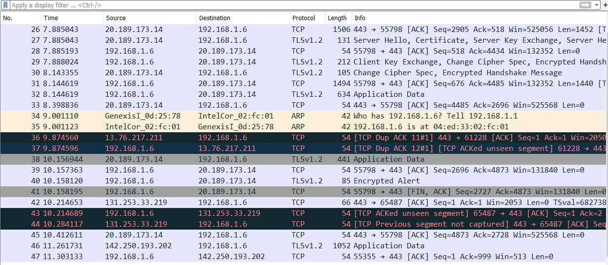

2. yes, able to see the dns request, screenshot attached below

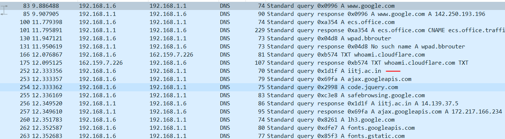

- http and tcp requests are as follows

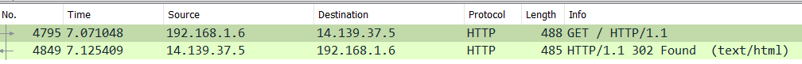

- from above image we can see that we have an http GET request and by doing that we get the web page on the browser

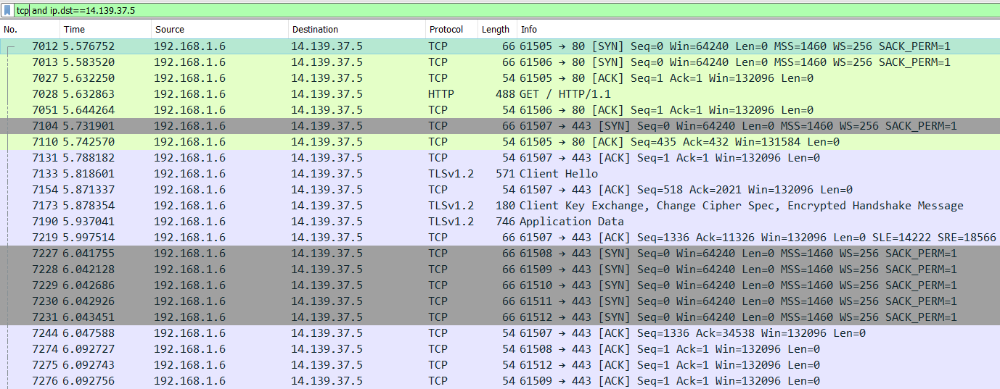

- ip for iitj.ac.in = 14.139.37.5

3. packet highlighted with black shows that the packet is lost or 3 dup acks are received for a packet which basically means that the packet needs to be retransmitted. screen shots attached below

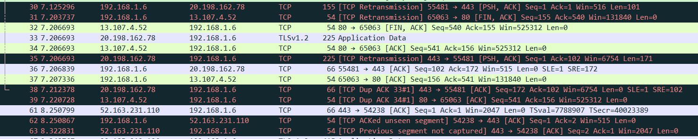

4. various filters and their uses are shown below (start capturing packets then open some websites like (iitj.ac.in, github.com, leetcode.com))

- > ip.dst==13.234.176.102  (querying a particular ip)

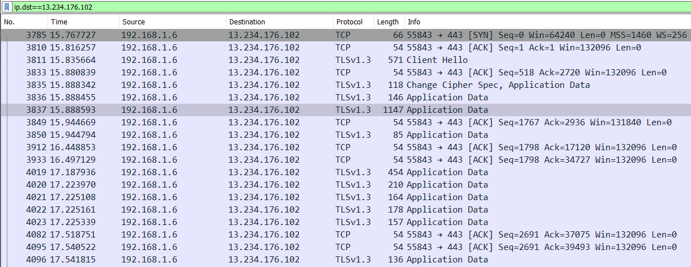

- > tcp.port == 80 or tcp.port == 443 or tcp.port == 8080 (or filter)

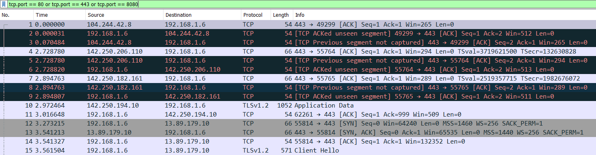

- > tcp and ip.dst==13.234.176.102 (and filter)

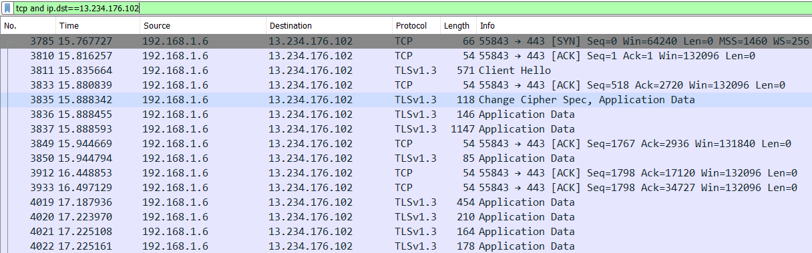

- > not ip.dst==13.234.176.102 (not filter)

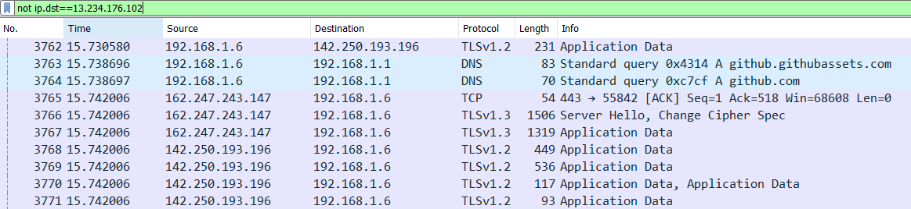

- > http.request.method=="GET"

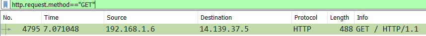

5. **ip.src == 192.168.1.6** (since we need to get all outgoing traffic then we can filter the src ip address of our computer to get what all packets are going out of our ip address)

6. visit a website (say leetcode.com (ip = 104.26.8.101)) and observe the tcp connection in wireshark

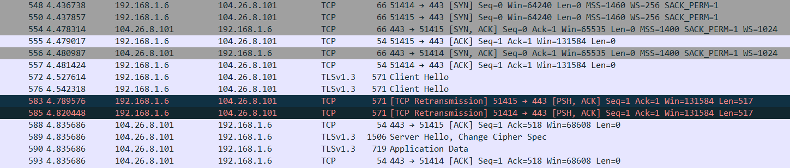

- from above image we can observe that first client (192.168.1.6) sends SYN signal to server and then in return it receives an ACK from 104.26.0.101 then client sends another ACK to the server in response to the previous ACK by server and hence the connection is established between (192.168.1.6) and (104.26.0.101)

7. UDP is a faster protocol than TCP (as it requires 3-way handshaking which is slow), in DNS the requests are very small with a small response which also fits in UDP packets and also DNS don't require to maintain connection as in case of TCP and hence DNS uses UDP but in case of HTTP, it requres a reliable data transfer and needs to maintain a longer connection with the server and hence TCP is suitable for it.

8. Since the client and server program are running on localhost and hence we need to capture localhost traffic so switch from wireless (wifi) to Adapter for loopback packet capture and run the client and socket program

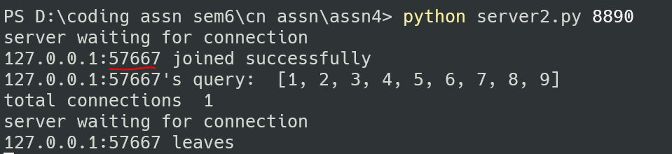

- from above image we can see that client has joind with port 57667

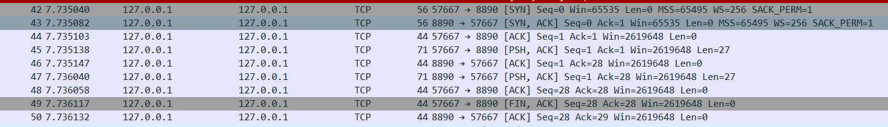

- from above figure we can see the communication between port 8890 (server port) and port 57667, we can observe that first client has send server req to join then server replied with an ack and then finally client responded and hence 3 way handshake is done, so now client has started sending data which has len=27 (from the figure) and then after the client closes the connection, it sends fin ack and the connection closes

9. connect to vpn and logon to home.iitj.ac.in (ip = 172.16.100.51) server using command

- > ssh sharma.59@172.16.100.51
- > apply filter (ssh) to wireshark

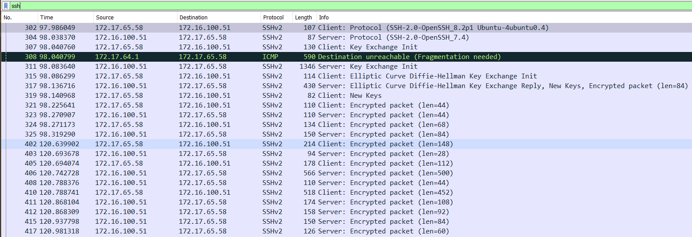

- observe here that the destination ip is same as 172.16.100.51 and it establish ssh connection with remote iitj server and starts sending it packets.

---

