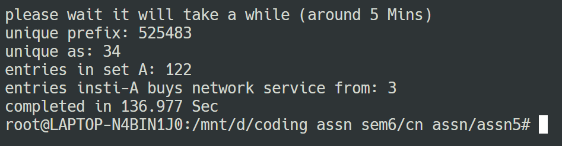

## Nirbhay Sharma (B19CSE114)
## Computer Networks Lab - 5

---

1. answers are given below:

- Unique ip prfixes : $525483$
- Unique Ases : $34$

2. the desired output (prefix, as_path) is generated in *a.txt* file once the code will be executed.

3. the output can be found at *whois_a.txt* file which is basically three ases values 

    website used for as lookup = [link1](https://mxtoolbox.com/asn.aspx),
      [link2](https://dnschecker.org/asn-whois-lookup.php?query=4323)

|as_values|Name|
|---|---|
|4755|Tata Communications Limited|
|55410|Vodafone Idea Ltd. (VIL)|
|55824|National Knowledge Network|

4. the output can be found at top_10_ases.txt file

|as_values|Name|
|---|---|
|174|Cogent Communications|
|3356|Level 3 Parent, LLC|
|6939|Hurricane Electric LLC|
|7018|AT&T Services, Inc.|
|4323|Level 3 Parent, LLC|
|209|CenturyLink Communications, LLC|
|701|Verizon Business|
|6461|Zayo Bandwidth|
|3549|Level 3 Parent, LLC|
|9002|RETN Limited|

these organizations are looking like an ISP organizations which basically tries to send data through the use of their autonomous systems.

**output after running the code**

---

