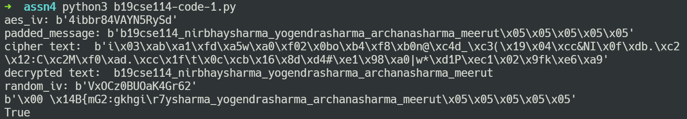
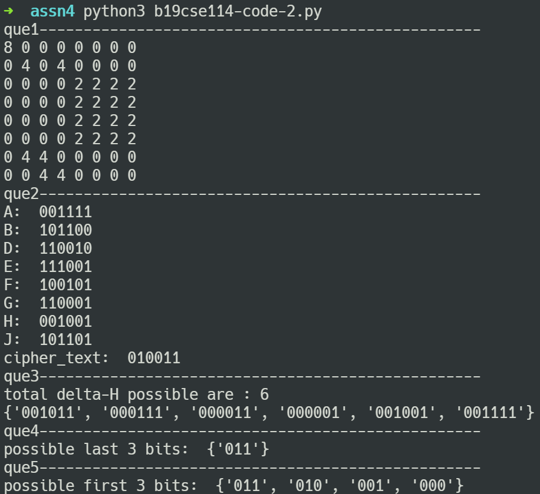

## Nirbhay Sharma (B19CSE114)
## Cryptography - Assignment - 4

---
### **que1**

**part-a**
- encryption and decryption function has been implemented using python Crypto library and the above mentioned code is available in the file b19cse114-code-1.py

**part-b**
- oracle function has been implemented by first decrypting the cipher text and then checking the last b bits where b is the padding value required to make it a multiple of 16. 

**part-c**
- output of padded plaintext is shown in <a href='#img1'>figure</a>

**part-d**
- output of encrypted cipher text is shown in <a href='#img1'>figure</a>

### **que2**

**part-a**
- output provided at <a href='#img2'>figure</a>

**part-b**
- output provided at <a href='#img2'>figure</a>

**part-c**
- brute force has been used to find $\delta h$ first all the values of $p$ and $p'$ for which $p \oplus p' = 000001$ and there are 32 such pairs (actually there are 64 but it won't matter because in $\delta h$, order of $p$ and $p'$ won't matter)
- out of the those 32 pairs each of the pair is passed through SPN and $\delta h$ is found using $h \oplus h'$ and stored in set and found to be 6 unique values of $\delta h$ with detail output shown in <a href='#img2'>figure</a>

**part-d**
- attack algorithm has been developed as follows
    - observe that two pairs of plain text has the same property as in part-c i.e $p \oplus p' = 000001$
    - also observe that $\delta h$ is invarient of keys $(k_1,k_2,k_3,k_4)$ and hence we can exploit this property to develop an attack
    - algorithm is to go from backward in SPN network, we can observe that $j = c \oplus k_4$ so we can iterate through each of the possible key value (it is 8 because we are finding last 3 bit of key $k_4$), so iterate over all the key values and find corresponding $j's$ for both $(pt_1,ct_1)$ and $(pt_2,ct_2)$ - then pass these $j's$ last 3 bits to s-box in backward fashion and find $h$ and $h'$ and xor them resulting to $\delta h$
    - now utilizing property 2 that $\delta h$ is invarient of keys so we can check that for which key value we get a valid $\delta h$ value (valid $\delta h$ value is whose last 3 bits are matching with the last 3 bits of possible values of $\delta h$ as found in part-c) 
    - iterate the above process for all the plain text and ciphertexts and take the intersection of the valid keys
    - output is shown at <a href='#img2'>figure</a>
    - last 3 bits of $k_4$ are $011$

**part-e**
- repeat the algorithm in part-d with first 3 bits and find out all possible values of keys by intersection from all the plain text and ciphertext, we can see the output at <a href='#img2'>figure</a>, 4 potential keyvalues are possible for first 3 bits and notice that first bit is same for all the keys i.e $0$ and hence we can find another bit of $k_4$ which is first bit, i.e. $0$
- $k_4$ = $0\\_\\_011$

---

