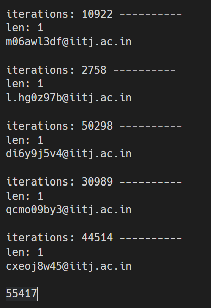
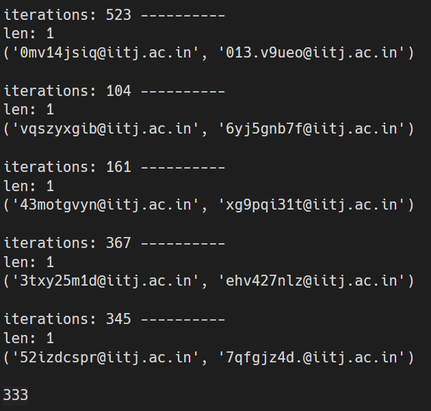
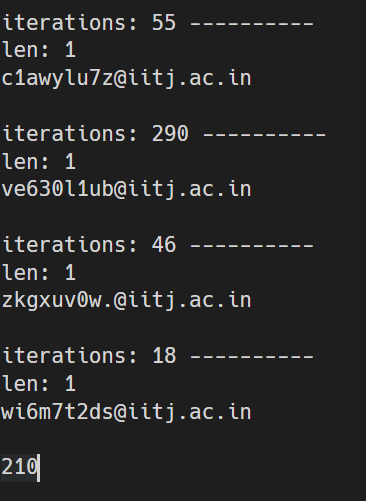
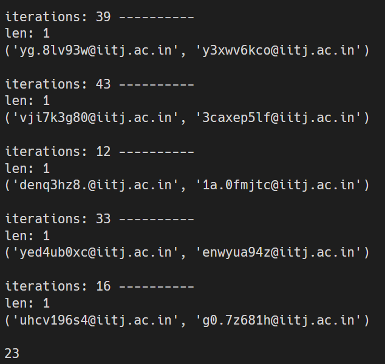
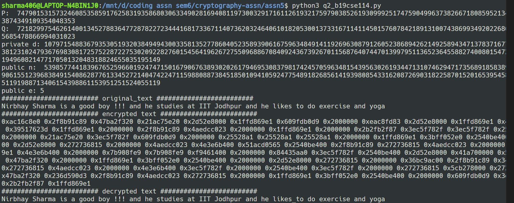
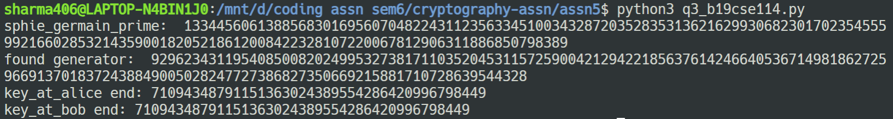
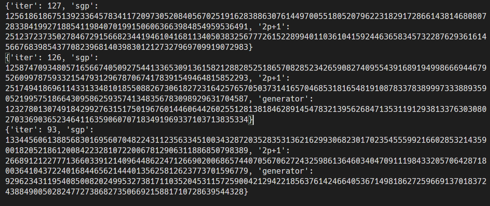

## Nirbhay Sharma (B19CSE114)
## Cryptography - Assignment-5

---

### **Que-1**

**output considering first 32 bits (4 bytes = 4 chars of hash)**
1. $x$ corresponding to emailId(sharma.59@iitj.ac.in) - log(iterations) = $16$ 
2. finding $(x,y)$ - log(iterations) = $9$

<span>   </span>

it is clearly visible that finding an $x$ which has 32 bit common with (sharma.59@iitj.ac.in) is hard as compared to finding two values $(x,y)$ such that their first 32 bits are matching as the first case is the case of second pre image matching and second case is the case for collision and it is always easy or less expensive (computationally) to find collisions than to find second pre image, and hence first case took many iterations to find out the answer. 

**output considering first 16 bits (2 bytes = 2 chars of hash)**
1. $x$ corresponding to emailId(sharma.59@iitj.ac.in) - log(iterations) = $8$ 
2. finding $(x,y)$ - log(iterations) = $5$

<span>   </span>

it is clearly visible that finding an $x$ which has 16 bit common with (sharma.59@iitj.ac.in) is hard as compared to finding two values $(x,y)$ such that their first 32 bits are matching as the first case is the case of second pre image matching and second case is the case for collision and it is always easy or less expensive (computationally) to find collisions than to find second pre image, and hence first case took many iterations to find out the answer. 


### **Que-2**

**output of the code for RSA encryption and decryption**



### **Que-3**

1. proving that a cyclic group of $n$ elements has $\phi(n)$ generators


**output of the code for sophie_germain_prime and diffie_hilmann_exchange**


- according to definition sophie germain prime is a prime number $p$ such that $2p+1$ is also a prime (safe prime)



some more sophie germain primes are shown below -:



---
## **codes for question 1, 2, and 3**

**code-1**

```py
from Crypto.Hash import SHA256
import random,time,os

def find_hash(text):
  new_hash = SHA256.new()
  new_hash.update(bytes(text,'utf-8'))
  return new_hash.hexdigest()

def condition(text1,text2,first_bits=4):
  return (text1[:first_bits] == text2[:first_bits])

def generate_random(num):
  text = list('abcdefghijklmnopqrstuvwxyz0123456789.')
  random_bits = ''.join(random.sample(text,num))
  return random_bits

def write_to_file(filename,iterations,array):
  with open(filename,'a') as f:
    string = f'iterations: {iterations} ----------\nlen: {len(array)}\n{" ".join(map(lambda x:str(x),array))}\n\n'
    f.write(string)

def generate_pairs(size1,size2):
  p1 = generate_random(size1) + '@iitj.ac.in'
  p2 = generate_random(size2) + "@iitj.ac.in"
  return p1,p2


h1 = find_hash('sharma.59@iitj.ac.in')
print(h1)

def n_calls(h1):
   t1 = time.perf_counter();

   l = []
   iterations = 0
   max_iterations = int(1e6)
   while (True):
      generated_value = generate_random(9) + '@iitj.ac.in'
      h2 = find_hash(generated_value)
      iterations += 1
      if (condition(h1,h2)):
         l.append(generated_value)
         break;
      if (iterations > max_iterations):
         break;

   if (len(l) > 0):
      write_to_file('output1.txt',iterations,l)
   else:
      print('len = 0')

   t2 = time.perf_counter()

   print(f'completed in {(t2-t1)/60:.2f} Mins')
   return iterations;

def find_pairs(values_match):
   t1 = time.perf_counter();

   l = []
   iterations = 0
   max_iterations = int(1e6)
   values_map = {}
   while (True):
      generated_value1 = generate_random(9) + "@iitj.ac.in"
      h1 = find_hash(generated_value1)
      iterations += 1
      if (h1[:values_match] in values_map):
         l.append((values_map[h1[:values_match]],generated_value1))
         break;
      else:
         values_map[h1[:values_match]] = generated_value1;
      if (iterations > max_iterations):
         break;

   # print(len(l))

   # print(l)
   if (len(l) > 0):
      write_to_file('output2.txt',iterations,l)
   else:
      print('len = 0')

   t2 = time.perf_counter()

   print(f'completed in {(t2-t1)/60:.2f} Mins')
   return iterations;

# check_iterations(h1)
filenames = ['output1.txt','output2.txt']
for filename in filenames:
   if (os.path.exists(filename)):
      os.remove(filename)

output1_iterations = 0
output2_iterations = 0
n = 10;
for i in range(n):
   output1_iterations += n_calls(h1) / n
   output2_iterations += find_pairs(4) / n

with open('output1.txt','a') as f:
   f.write(str(int(output1_iterations)))

with open('output2.txt','a') as f:
   f.write(str(int(output2_iterations)))

exit(0)
```

**code-2**

```py
import random
import sys
sys.setrecursionlimit(1030)

def extended_eucledian(a,b):
    if (a%b == 0): return (b,0,1)
    val = [[a,1,1,0],[b,a//b,0,1]]
    while val[-1][0] != 1:
        new_val = []
        new_val.append(val[-2][0] % val[-1][0])
        if (new_val[0] == 0): return (val[-1][0],val[-1][-2],val[-1][-1])
        new_val.append(val[-1][0] // new_val[0])
        new_val.append(val[-2][-2] - val[-1][1] * val[-1][-2])
        new_val.append(val[-2][-1] - val[-1][1] * val[-1][-1])
        val.append(new_val)  
    return (val[-2][1],val[-1][-2],val[-1][-1]);

class rsa_algorithm(object):
    def __init__(self):
        # self.p = 10888869450418352160768000001
        # self.q = 265252859812191058636308479999999
        self.p = self.generate_prime();
        self.q = self.generate_prime();
        # self.p = 155;
        # self.q = 21711;
        print('P: ',self.p)
        print('Q: ',self.q)
        self.phi_n = (self.p-1)*(self.q-1)
        self.n = self.p * self.q
    def find_e(self):
        for i in range(3,100,2):
            gcd,x,y = extended_eucledian(self.phi_n,i)
            if (gcd == 1):
                return (i,y)

    def rsa_encryption(self,msg):
        self.e,self.__d = self.find_e();
        # print('inside d:',self.__d)
        if (self.__d < 0):
            print('d < 0, making it positive !!!')
            self.__d = self.phi_n + self.__d
        encoded_string = []
        encoded_msg = bytes(msg,'utf-8')
        for char in encoded_msg:
            encoded_string.append(self.modulo_exponentiation(char,self.e,self.n))        
        return ''.join(map(lambda x: bytearray(hex(x),'utf-8').decode() + ' ' ,encoded_string))[:-1]

    def rsa_decryption(self,cipher):
        decoded_msg = []
        for i in cipher.split(' '):
            cipher_msg = i.strip();
            cipher_msg = int(cipher_msg.encode(),16)
            # print(f'cipher msg: {cipher_msg}')
            decoded_msg.append(self.modulo_exponentiation(cipher_msg,self.__d,self.n))
        # print(decoded_msg)
        # return 
        return ''.join(map(lambda x:chr(x),decoded_msg))


    def square_multiply(self,bas,exp):
        if (exp == 0): return 1;
        if (exp == 1): return bas;
        if (exp & 1):
            return bas * self.square_multiply(bas * bas, (exp-1)//2)
        else:
            return self.square_multiply(bas * bas,exp//2)

    def modulo_exponentiation(self,bas,exp,N):
        if (exp == 0):
            return 1;
        if (exp == 1):
            return bas % N;
        t = self.modulo_exponentiation(bas, exp // 2,N);
        t = (t * t) % N;
        if (exp % 2 == 0):
            return t;
        else:
            return ((bas % N) * t) % N;

    def generate_random_512(self):
        return int("1"+ ''.join([random.choice(["0","1"]) for _ in range(510)])  + "1",2)

    def find_s_t(self,num):
        new_num = num - 1;
        s = 0;
        while (new_num & 1 == 0):
            s += 1;
            new_num >>= 1;
        return (s,new_num)

    def miller_rabin_test(self,num,s,t):
        new_num = num - 1;
        aa = random.randint(2,new_num)
        b_i = self.modulo_exponentiation(aa,t,num);
        if (b_i == 1 or b_i == num - 1):
            return 1;
        pow_2 = 0;
        while (True):
            pow_2 += 1
            if (pow_2 == s+1):
                break;
            b_i = self.modulo_exponentiation(b_i,2,num);
            # if (b_i == 1): return 0;
            if (b_i == num - 1): return 1;
        return 0;

    def _check_prime(self,num):
        s,t = self.find_s_t(num);
        for i in range(100):
            vote = self.miller_rabin_test(num,s,t)
            if (vote == 0):
                return False;
        return True;


    def generate_prime(self):
        a = False;
        final_prime = None;
        # iterations = 0;
        while (not a):
            # iterations+=1
            final_prime = self.generate_random_512()
            a = self._check_prime(final_prime)
        # print(iterations)
        return final_prime;

    def fast_modulo_exponentiation(self,base,power,N):
        dp = [-1]

            

        

    

original_text = "Nirbhay Sharma is a good boy !!! and he studies at IIT Jodhpur and he likes to do exercise and yoga";
rsa = rsa_algorithm();

# print(rsa.generate_prime())
# print(rsa.generate_prime())
# exit(0)

enc = rsa.rsa_encryption(original_text);

print('private d:',rsa._rsa_algorithm__d)
print('public n: ',rsa.n)
print('public e:',rsa.e)

print('#'*25 + ' original_text ' + '#'*25)
print(original_text)

print('#'*25 + ' encrypted text ' + '#'*25)
print(enc)

dec = rsa.rsa_decryption(enc)
print('#'*25 + ' decrypted text ' + '#'*25)
print(dec)
```

**code-3**

```py
import random, json, os

def modulo_exponentiation(bas,exp,N):
    if (exp == 0):
        return 1;
    if (exp == 1):
        return bas % N;
    t = modulo_exponentiation(bas, exp // 2,N);
    t = (t * t) % N;
    if (exp % 2 == 0):
        return t;
    else:
        return ((bas % N) * t) % N;

def square_multiply(bas,exp):
    if (exp == 0): return 1;
    if (exp == 1): return bas;
    if (exp & 1):
        return bas * square_multiply(bas * bas, (exp-1)//2)
    else:
        return square_multiply(bas * bas,exp//2)

def write_to_file(filename,dictionary):
    with open(filename, 'a') as f:
        f.write(str(dictionary) + "\n")

def find_generator(prime_p):
    while True:
        random_a = random.randint(2,prime_p-1)
        rem = modulo_exponentiation(random_a,prime_p-1,prime_p)
        if (rem == 1): return random_a;


class Prime_generator_machine(object):
    def __init__(self,bits_in_prime):
        self.bip = bits_in_prime;
    
    def modulo_exponentiation(self,bas,exp,N):
        if (exp == 0):
            return 1;
        if (exp == 1):
            return bas % N;
        t = self.modulo_exponentiation(bas, exp // 2,N);
        t = (t * t) % N;
        if (exp % 2 == 0):
            return t;
        else:
            return ((bas % N) * t) % N;

    def generate_random_bits(self):
        return int("1"+ ''.join([random.choice(["0","1"]) for _ in range(self.bip-2)])  + "1",2)

    def find_s_t(self,num):
        new_num = num - 1;
        s = 0;
        while (new_num & 1 == 0):
            s += 1;
            new_num >>= 1;
        return (s,new_num)

    def miller_rabin_test(self,num,s,t):
        new_num = num - 1;
        aa = random.randint(2,new_num)
        b_i = self.modulo_exponentiation(aa,t,num);
        if (b_i == 1 or b_i == num - 1):
            return 1;
        pow_2 = 0;
        while (True):
            pow_2 += 1
            if (pow_2 == s+1):
                break;
            b_i = self.modulo_exponentiation(b_i,2,num);
            # if (b_i == 1): return 0;
            if (b_i == num - 1): return 1;
        return 0;

    def _check_prime(self,num):
        s,t = self.find_s_t(num);
        for i in range(100):
            vote = self.miller_rabin_test(num,s,t)
            if (vote == 0):
                return False;
        return True;


    def generate_prime(self):
        a = False;
        final_prime = None;
        # iterations = 0;
        while (not a):
            # iterations+=1
            final_prime = self.generate_random_bits()
            a = self._check_prime(final_prime)
        # print(iterations)
        return final_prime;


pgm = Prime_generator_machine(512)

def generate_sophie_germain_prime(pgm,thresh):
    sgp = None;
    iterations = 0;
    p_dash = 0
    while True:
        p_dash = pgm.generate_prime()

        # print(f'p_dash prime_test: {pgm._check_prime(p_dash)}')
        iterations += 1
        print(f'iterations: {iterations}',end='\r')
        sophie_germain_prime = 2*p_dash + 1
        if (pgm._check_prime(sophie_germain_prime)):
            sgp = sophie_germain_prime
            break;
        if (iterations == thresh): 
            break;
        # print(f'sophie germain prime test: {pgm._check_prime(sophie_germain_prime)}')

        # print('p_dash:',p_dash)
        # print('generated sophie germain prime:',sophie_germain_prime)
    # print('p_dash:',p_dash)
    return ((p_dash,sgp,iterations) if sgp is not None else ("None","None",iterations));


thresh = 1000
sophie_germain_prime,condition_sophie_germain,iterations = generate_sophie_germain_prime(pgm,thresh)
if condition_sophie_germain == "None":
    print(f'cannot find sophie germain prime till {thresh} iterations !!! Try running again')
    exit(0)
print('sphie_germain_prime: ',sophie_germain_prime)
generator = find_generator(sophie_germain_prime)
write_to_file('sophie-germain-prime.txt',{"iter":iterations,"sgp":sophie_germain_prime,"2p+1":condition_sophie_germain,"generator":generator})
# for a prime order group every element is a generator
print('found generator: ',generator)

# exit(0)

class Alice(object):
    def __init__(self,g):
        self.a = random.randint(3,10)
        self.g = g
    
    def _generate_key(self):
        return square_multiply(self.g,self.a)

    def _generate_final_key(self,bob_g_random):
        return square_multiply(bob_g_random,self.a)

class Bob(object):
    def __init__(self,g):
        self.b = random.randint(3,10)
        self.g = g
    
    def _generate_key(self):
        return square_multiply(self.g,self.b)

    def _generate_final_key(self,alice_g_random):
        return square_multiply(alice_g_random,self.b)

def diffie_hilmann_exchange(g):
    alice = Alice(g)
    bob = Bob(g)

    alice_generated_key = alice._generate_key()
    bob_generated_key = bob._generate_key()

    final_key_at_alice = alice._generate_final_key(bob_generated_key)
    final_key_at_bob = bob._generate_final_key(alice_generated_key)

    print("key_at_alice end:",final_key_at_alice)
    print('key_at_bob end:',final_key_at_bob)
    # print(final_key_at_alice==final_key_at_bob)
    

diffie_hilmann_exchange(23)

```
---

<style> 

table, th, td {
  border: 0.1px solid black;
  border-collapse: collapse;
}

</style>

<script type="text/javascript" src="http://cdn.mathjax.org/mathjax/latest/MathJax.js?config=TeX-AMS-MML_HTMLorMML"></script>
<script type="text/x-mathjax-config">
    MathJax.Hub.Config({ tex2jax: {inlineMath: [['$', '$']]}, messageStyle: "none" });
</script>
