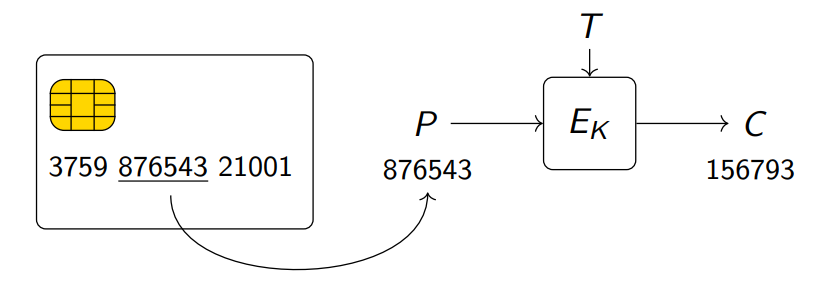
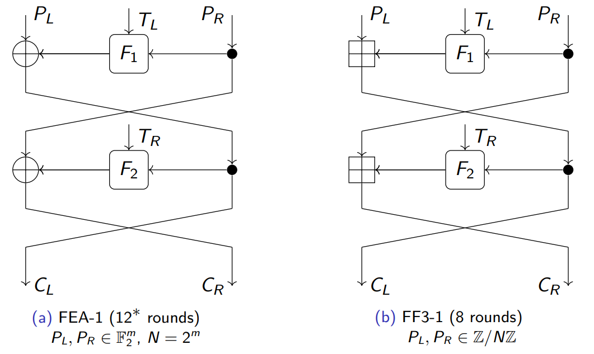

## Cryptography - Course Project
## Linear Cryptanalysis of FF3-1 and FEA
## Final Report
---

### **Team Members**

- Nirbhay Sharma (B19CSE114)
- Mayank Raj (B19CSE053)

### **Introduction**

Format preserving encryption is an encryption scheme in which the ciphertext is in the same format as the plaintext. It's applications are found in credit cards numbers and encrypting social security number. Techniques such as cycle walking can be used for transfroming blocks ciphers into format preserving ciphers. This method is inefficient when there is a significant size difference between domain size and target size. To tackle this problem self-domain tweakable Feistel ciphers were introduced. **FF1** and **FF3-1** (NIST) and **FEA-1** and **FEA-2** (South Korean standards ) are examples of such schemes.

Linear cryptanalysis is a form a cryptanalysis based on finding affine approximations to the action of a cipher. Many attacks have been proposed on the format preserving encryptions. The paper "Linear Cryptanalysis of FF3-1 and FEA" develops linear cryptanlysis based new distingushing and message-recovery attacks on small domain Feistel ciphers. The paper dicusses Linear distinguishers and $\chi^2$ distinguishers for FEA-1, FEA-2 and FF3-1. The paper then talks about recovery of left part and right part of plaintext for the encryption scheme.

### **Linear Cryptanalysis**
As we are aware of the two attacks that can be applied on symmetric-key block ciphers, that are linear and differential cryptanalysis, in this part we are only talking about linear cryptanalysis with SPN (Substitution Permutation Network) as one usecase.

Before going into details of Linear cryptanalysis, a little glimpse of SPN is required, so in SPN we have various rounds and in each round we have,

1. **substitution step** - so A 16 bit data block is broken into 4 sub-blocks and then each sub-block is given as an input to the $4 \times 4$ s-box which basically maps 4 bits to another 4 bits. In this way substitution step is done.
2. **permutation step** - This step is just outputs a permutation of the output coming from previous substition layer.
3. **key mixing** - This step is just doing xor ($\oplus$) of the keys biths with the data input to this layer.

After some particular number of rounds we get some cipher text which is the encrypted version of input, and for decryption we use the reverse of the network just like we use in case of feistel structure and for s-boxes we have an inverse mapping to be used at the time of decryption.

So now let's have a look at linear cryptanalysis, Linear cryptanalysis was first introduced by Matsui at EUROCRYPT 93 as an attack on Data Encryption Scheme (DES) and later it became a successfull attack not only on DES but also on some other block ciphers as well, It is a known plaintext attack, It tries to take advantage of linear relationship expressions that may exists among bits of plain text and cipher text. the definition of linearity is to get a combination of bits whose xor's become zero. consider the input to be represented as $X = (X_1,X_2,...,X_j)$ and output as $Y = (Y_1,Y_2,...,Y_j)$ so our task is to find some linear relationship as follows

$$
\alpha_1 X_1 \oplus \alpha_2 X_2 \oplus ... \oplus \alpha_j X_j \oplus \beta_1 Y_1 \oplus \beta_2 Y_2 \oplus ... \oplus \beta_j Y_j = 0
$$

where $\alpha_i,\beta_i \in \\{0,1\\}$

the aim of linear cryptanalysis is to find the expressions of such form with some high probability, consider the fact that if we take two values $u$ and $v$ randomly and put their xor to zero $u \oplus v = 0$, will have exactly $\frac{1}{2}$ probability so we want the probability to be $\frac{1}{2} + \epsilon$, where $\epsilon$ is the bias and this is what which is exploited in linear cryptanalysis for which ever expression we got higher bias, it means we have a high probability for that expression to occur and hence this can be exploited to get some information about keys etc. 

To find the bias for an expression $Pr[X_1 \oplus X_2 \oplus ... \oplus X_j = 0]$, we have a Piling up lemma which say
$$
Pr[X_1 \oplus X_2 \oplus ... \oplus X_j = 0] = \frac{1}{2} + 2^{n-1}\prod_{i=1}^{n} {\epsilon_i}
$$

where $\epsilon_i = Pr[X_i=0] - \frac{1}{2}$ and

$\epsilon_{1,2,...,n} = 2^{n-1}\prod_{i=1}^{n} {\epsilon_i}$, $\epsilon_{1,2,...,n}$ is the overall bias for the expression $Pr[X_1 \oplus X_2 \oplus ... \oplus X_j = 0]$

so using the above expression, we can generate various probabilities and their probabilities for satisfying the criteria and we construct a linear approximation table which tells us which expressions are matching with which probability.

so for the SPN example we have s-box of $4 \times 4$ so the expression would be,

$$
\alpha_1 X_1 \oplus \alpha_2 X_2 \oplus \alpha_3 X_3 \oplus \alpha_4 X_4 \oplus \beta_1 Y_1 \oplus \beta_2 Y_2 \oplus \beta_3 Y_3 \oplus \beta_4 Y_4 = 0 \hspace{1cm} -eq-1
$$ 

notice that we have two sequences here $\alpha_1 \alpha_2 \alpha_3 \alpha_4$, $\beta_1 \beta_2 \beta_3 \beta_4$ and linear approximation table is exactly utilizing this, it takes all possible combinations of these two sequences for input and output and accordingly generate the values by which expression in eq-1 can be satisfied. a sample linear approximation table is shown below

In this manner linear cryptanalysis tries to find the linear relations among the bits of input and output and higher probability expressions are exploited to further crack some of the key bits etc.

### **Format Preserving Encryption (FPE) Schemes**

These are the encryption schemes where input and output have the same format for example the number is encrypted to the number itself, credit card is encrypted to another credit card number.Some of the constructions of the FPE technique are 

**Need of tweaks**

- Since the format preserving encryption schemes maps a number to another number (preserve format) and so for the usecase of credit cards the 8-10 length character is mapped to another 8-10 length number and so the encryption values are limited in this case only ($10^8$) and so the tweaks comes to rescue, the tweaks in the fiestel structure ensures the variety of the encrypted ciphertext.

**Construction FFX (FF1,FF2,FF3)**

These FPEs were standardised by NIST. FF1 and FF2 uses atleast 10 round of Feistel and each round has one invocation to AES. 

FF3 uses only 8 rounds and thus is faster than FF1/FF2. It consist of two components:

- Internal block cipher: It is used to encrypt data while preserving the format.
- Handling long messages: Due to this maximum input size get fixed.

FF3-1 is an eight-round Feistel cipher over $Z/NZ \oplus Z/NZ$. The round functions F1, F2, . . . are defined as truncations of the AES with the round tweak and
a unique round counter as the input; the details are not important for this work
as these functions will be modelled as uniform random. The tweaks TL and TR
are bitstrings of length 28.

<!--  -->

<!-- Structure of two round FF3-1 -->

**Structural details of FEA-X**

<!-- 2 rounds of tweakable feistel structure are shown in the figure below:

 -->

the structural details of the format preserving ciphers (FEA-1, FEA-2) are as follows
- FEA-1 and FEA-2 has rounds depending upon the key size as shown in table below

|Key Length|FEA-1|FEA-2|
|---|---|---|
|$128$|$12$|$18$|
|$192$|$14$|$21$|
|$256$|$16$|$24$|

in the above image as we can see that FEA-1 has $P_r, P_l \in F_2^n$ and in FF3-1 the only difference is that the $P_r,p_l \in Z/NZ$ group which is an additive modulo N group and so the analysis on FEA-1 can be easily extended to the analysis of FF3-1 algorithm. 

### **Distinguishers**

**Linear approximator and Distinguisher**

Consider a function F:$F_2^n \to F_2^m$, and the conversion is dependent on some key K, and so linear discriminators are based on linear approximators with large coorrelation so mathematically a linear approximation F is is defined by a pair of mask (u1,u2) $\in F_2^n \oplus F_2^m$ space and is equal to

$$
C_{u1,u2}^F = 2 Pr[u_1^TF(x) = u_2^Tx] - 1 
$$

where the expression is bias terms for F and is finally equal to 

$$
\frac{1}{2^n} \sum_{x \in F_2^n} (-1)^{u_1^TF(x) + u_2^Tx}
$$

the correlations for a uniform random function has mean 0 and standard deviation around $2^{-n/2}$ so if the standard deviation of the distribution is deviating from the above then the distinguisher can be constructed and the result is compared using some threshold t. Consider a function F: G $\to$ H, where G and H are finite Abelian groups, a linear approximator corresponds to pair of characters ($\psi_1,\psi_2$) of H and G is represented as 

$$
C_{\psi_1,\psi_2}^F = \frac{1}{|G|} \sum_{x \in G} \overline{\psi_1(F(x))}\psi_2(x)
$$

where $\overline{\psi_1}$ denotes the complex conjugate of the $\psi_1$ and basically $\psi_1$ corresponds to a vector u $\in F_2^m$ and the important property of these group characters are that they are orthogonal in nature, mathematically speaking they have the following property

$$
\sum_{x \in G} \overline{\chi(x)} \psi(x) =  |G| 
$$ 
when $\chi = \psi$ and 0 otherwise

now a sequence of such function is constructed as $F_1, F_2, ..., F_l$ and the correlation between them can easily calculated using piling up principle of linear distinguisher (explained above under the heading Linear Distinguishers) and hence following from that the collective correlation can be found using below formulae

$$
C_{\psi_1,\psi_{l+1}}^F = \prod_{i=1}^{l} C_{\psi_i,\psi_{i+1}}^{F_i}
$$

and once the correlation is find output the breaking is simple and we can take the advantage of this bias term to break the cipher.

The distinguisher performs a hypothesis test, with null-hypothesis being that the data comes from an ideal tweakable block cipher and alternative hypothesis that data comes from real cipher.If the absolute value of the estimated correlation exceeds a predetermined threshold, then the null hypothesis is rejected.There is always a tradeoff between success probablity $P_{s}$ and false positive rate $P_{f}$

**$\chi^2$ distinguisher**

The distinguishers on FEA-1, FEA-2 and FF3-1 are proposed on the basis of Pearson's $\chi^2$-test for goodness-of-fit between distributions. The $\chi^2$ distinguishers are use to distinguish non uniform distributions in cryptanalysis when exact knowledge about the distributions are missing.

A collection of linear approximations such that the set of pairs of input and output masks is a vector space can be called as multidimensional linear approximation.This can be generalised to arbitary groups given the set of input and output characters is a group under pointwise multiplication. The existence of multidimensional linear approximation implies that a particular probablity distribution related to the ciphertext is highly non-uniform and therefore Pearson's $\chi^2$-test can used to verify this property which can termed as a distinguisher.

The relation between $\chi^2$ 2-distinguishers and multidimensional linear approximations is due to the link between correlations and the Fourier transformation of the probability distribution of the active parts of the input and output state. Pearson's $\chi^2$-statistic is used for estimating goodnesds-of-fit between empirical probablity distribution $\^{p}:S \rightarrow [0,1]$ and uniform probablity distribution on S. The $\chi^2$-statistic with q samples satisfies 

$\chi^2/q=M||\hat{p}-1/M||_{2}^{2}$

here, $|| \ \ ||_{2}^{2}$ represents euclidean norm, $M=|S|$ and $1(x)=$ 1 for all $x \epsilon S$.

As $q \rightarrow \infty$ the estimated distribution $\hat{p}$ tends to the true distribution $p$ and $\chi^2/q$ tends to $M||p-1/M||_{2}^{2}$. So, if the distribution comes to be uniform as $q \rightarrow \infty$, $\chi^2/q$ tends to 0.

**Theorem**: Let $F:G \rightarrow H$ be a function between finite Abelian groups $G$ and $H$. Let $Z$ be a subgroup of the group $H \oplus G$ and let $Z^{0}$ be the group of characters of $H \oplus G$ with kernel $Z$. If **$x$** is a uniform random variable on $G$, then

$Pr[(F(x),x) \equiv z mod Z]=\frac{1}{|Z^{0}|}\sum_{\psi \epsilon Z^{0}} C_{\psi_{H},\overline{\psi}_{G}}^{F}\psi(z)$

$\psi_{H}$ is the restriction of $\psi$ to $H$ and $\psi_{G}$ is similarly for $G$.

This theorem, (proof can be found at <a href='#paper'>[4]</a>)  can be applied to the multidimensional linear approximations. For FEA-1 and FEA-2, $Z$ can be taken as the orthogonal complement of the $F_{2}$-vector space consisting of the masks in the multidimensional linear approximation. For FEA-1 and FF3-1, the right half of the plaintext is fixed and reduction modulo $Z$ is equivalent to taking the difference of the left half of the ciphertext and the plaintext.

If $D$ is the half-domain of the cipher and $T$ be the space of half-tweaks $T_{R}$ then we can deduce that

$H=D \oplus D$, $G=D \oplus T$ and $Z=\\{(y_{L},y_{R},x_{L},T_{R})\epsilon D \oplus D \oplus D \oplus T |y_{L}-x_{L}=0\\}$

For FEA-2 the full plaintext will be fixed, so $G=T$. In this case reduction modulo $Z$ will coorespond to truncating the ciphertext to its left half.

Lets $c(\psi)$ denotes the correlation of the approximation coressponding to $\psi \epsilon Z^0$. Using the previous theorem we can say that for all the 3 ciphers:

$Pr[F(x),x)\equiv z \ mod \ Z]=\frac{1}{|Z^0|} \sum_{\psi \epsilon Z^0}c(\psi)\psi(z)$

$x$ is uniform random on input domain and $F$ is the mapping to the ciphertext.

As the queries q increases in $\chi^2$ statistic, the empirical distribution reaches $p$ and  $\chi^2/q$ statistic approaches the value:
<!-- 
$$
M||p-1/M||_2^2 = ||c - \delta_1 ||_2^2 
$$ -->

$$
M ||p-1/M||_2^2 = || c - \delta_1 ||_2^2
$$

$$
= \sum_{\psi \neq 1} |c(\psi)|^2
$$

The $\chi^2$ statistic can be interpreted as an alternative method to estimate the sum of the squared correlations $|c(\psi)|^2$ for $\psi \epsilon Z^0$ with $\psi \neq 1$. Using this the data complexity of $\chi^2$ distinguisher for r rounds of FEA-1 and FF3-1 is of the order $N^{r/2 -1.5}$. For FEA-2 the data complexity is of the order $N^{r/3 -1.5}$. If we consider smallers choices for the group $Z$, we can set up $\chi^2$-distinguishers even if the part of ciphertext is available.
    

### **Message recovery attacks**

The message recovery attack using $\chi^2$ distinguisher has the following setup, as shown in the previous section of $\chi^2$ distinguisher, since the right half is fixed for input so the half domain is denoted by $D$ and tweaks space is denoted by $T$ and so H which is a ciphertest space is denoted by $D \oplus D$ since both the halfs are not constant and the $G$ which is input space represented by $D \oplus T$ for FEA-1 and FF3-1 for which right half is fixed and $G$ is $T$ in case of FEA-2 where both the halfs of plaintext are kept fixed 

attack for FEA-1 AND FF3-1  

**Left half recovery**

In this scenario the right half is fixed for the input messages and hence the $\chi^2$ distinguisher is represented as 

$$
Z = \\{(y_l,y_r,T_r) \in D \oplus D \oplus T | y_l = 0\\}
$$

so the core idea behind the attack is that since the right part is fixed and so the change in plain text affect only the left half of the ciphertext for tweaks $T_r$ so consider $c_1(x)$ as the correlation corresponding to character $\psi$ when plain text is ($x_l,x_r$) and the correlation is $c_2(x)$ for the input ($x_l',x_r$) (right half is fixed) so as explained in the linear approximator section the correlation can be computed in combine form using piling up principle (from linear distinguisher) and hence the two function are same upto the subtraction of constant $\triangle = x_l - x_l'$ in the first round and hence 

$$
c_2(\psi) = \psi_D(\triangle)c_1(\psi) 
$$

where $\psi_D$ is computed over the half domain space D, so the distributions of probabilities are shifted by a distance $\triangle$ so the attacks begins by estimating the distribution of the left half of the ciphertext twice, one for the message $(x_l,x_r)$ with fixed tweak $T_l$ (alternate tweaks) and another one for the arbitrary message $(x_l',x_r)$ (notice that the right half is still same) with the same alternate fixed tweaks $T_l$ and then we need to compute the statistic 

$$
r(\triangle_g) = qN/4 ||p_1 - p_g||_2^2
$$

where $p_1$ and $p_g$ are the distributions that differ by $\triangle$ now all these values are ranked in ascending order for all $\triangle_g \in D$ and the value at the top of the list is a good candidate for $\triangle$

**Right half recovery**

The idea behind the right half recovery is the exploitation of the following property, if we apply the left-half recovery method to any arbitrary $(x_l,x_r)$ and $(x_l',x_r')$ then the recovered difference $\triangle$ would be $\triangle = x_l - x_l' + F_1(x_r) - F_1(x_r')$ after first round, so if $x_l - x_l'$ is known then the adversary can recover the $\triangle$ to obtain the difference F_1(x_r) - F_1(x_r') and this is useful to recover the right half of the message, and we can also apply the same method using different values of Z and in that case the difference is $F_1(x_r) - F_1(x_r')$, the right half is recovered by finding $x_r'$ until the recovered difference is 0, i.e. $\triangle$ becomes 0, also the same idea of FEA-1 and FF3-1 can be applied to the FEA-2 algorithm and so for the left-half recovery the adversary can query the encryption of the secret message ($x_l,x_r$) under many tweaks with alternate constant tweaks like keep $T_l$ constant and for each guess of $x_l'$ similar queries are made of the form $(x_l',x_r)$, (right half same) and the values then can be used for identifying values of $x_l$ and so the equation becomes 

$$
F_2(x_l + F_1(x_r)) + x_r = F_2(x_l' + F_1(x_r)) + x_r
$$

and hence the value of $x_l$ can be identified from this 

### **Conclusion**

The author of the paper shows that the format preserving encryption schemes such as (FEA-1, FEA-2, FF3-1) are vulnerable to the linear cryptanalysis attack and the analysis in the paper is done on the small domain fiestel cipher with alternating round tweaks (T), The author proposes the method of attack as to vary the tweaks in every even number round for FF3-1 and FEA-1 and to vary it every 3 round in FEA-2 and the tweaks in all other rounds are fixed, the authors also discuss the linear approximator which finds out the variance of correlation and based on the deviation of the variance from the well known value helps us to exploit some good properties. The authors also utilize the method of multidimensional linear cryptanalysis, and using the $\chi_2$ distinguisher, which is based on the pearson chi-square test to find the deviation of two distribution from each other based on some threshold, finally the authors explained the message recovery attacks using the multidimensional linear cryptanalysis, the authors have mentioned about the left half message recovery and the right half message recovery, they basically find out the difference $\triangle = x_l - x_l'$ for each of them $x_r$ is fixed and hence removed from the equation and by revoring the value of $\triangle$ the left half can be recovered, and they also extend the same idea for arbitrary $(x_l,x_r)$, $(x_l',x_r')$ and used it to recover the another right half of the message, finally they also explained key recovery attacks using the left half recovery method.

### **References**

1.  https://www.isical.ac.in/~mridul/workshop/Slides/Somitra.pdf 
2.  https://ioactive.com/wp-content/uploads/2015/07/ldc_tutorial.pdf 
3.  https://pypi.org/project/ff3/ 
4.  https://eprint.iacr.org/2021/815.pdf 
4.  https://iacr.org/submit/files/slides/2021/crypto/crypto2021/83/slides.pdf 

---

