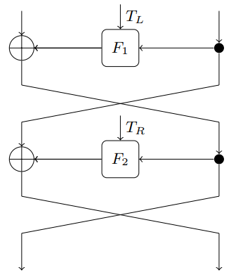

## Cryptography - Course Project
## Linear Cryptanalysis of FF3-1 and FEA
## Intermediate Report
---

### **Team Members**

- Nirbhay Sharma (B19CSE114)
- Mayank Raj (B19CSE053)


### **Introduction**

Format preserving encryption is an encryption scheme in which the ciphertext is in the same format as the plaintext. It's applications are found in credit cards numbers and encrypting social security number. Techniques such as cycle walking can be used for transfroming blocks ciphers into format preserving ciphers. This method is inefficient when there is a significant size difference between domain size and target size. To tackle this problem self-domain tweakable Feistel ciphers were introduced. **FF1** and **FF3-1** (NIST) and **FEA-1** and **FEA-2** (South Korean standards ) are examples of such schemes.

Linear cryptanalysis is a form a cryptanalysis based on finding affine approximations to the action of a cipher. Many attacks have been proposed on the format preserving encryptions. The paper "Linear Cryptanalysis of FF3-1 and FEA" develops linear cryptanlysis based new distingushing and message-recovery attacks on small domain Feistel ciphers. 

### **Linear Cryptanalysis**
As we are aware of the two attacks that can be applied on symmetric-key block ciphers, that are linear and differential cryptanalysis, in this part we are only talking about linear cryptanalysis with SPN (Substitution Permutation Network) as one usecase.

Before going into details of Linear cryptanalysis, a little glimpse of SPN is required, so in SPN we have various rounds and in each round we have,

1. **substitution step** - so A 16 bit data block is broken into 4 sub-blocks and then each sub-block is given as an input to the $4 \times 4$ s-box which basically maps 4 bits to another 4 bits. In this way substitution step is done.
2. **permutation step** - This step is just outputs a permutation of the output coming from previous substition layer.
3. **key mixing** - This step is just doing xor ($\oplus$) of the keys biths with the data input to this layer.

After some particular number of rounds we get some cipher text which is the encrypted version of input, and for decryption we use the reverse of the network just like we use in case of feistel structure and for s-boxes we have an inverse mapping to be used at the time of decryption.

So now let's have a look at linear cryptanalysis, Linear cryptanalysis was first introduced by Matsui at EUROCRYPT 93 as an attack on Data Encryption Scheme (DES) and later it became a successfull attack not only on DES but also on some other block ciphers as well, It is a known plaintext attack, It tries to take advantage of linear relationship expressions that may exists among bits of plain text and cipher text. the definition of linearity is to get a combination of bits whose xor's become zero. consider the input to be represented as $X = (X_1,X_2,...,X_j)$ and output as $Y = (Y_1,Y_2,...,Y_j)$ so our task is to find some linear relationship as follows

$$
\alpha_1 X_1 \oplus \alpha_2 X_2 \oplus ... \oplus \alpha_j X_j \oplus \beta_1 Y_1 \oplus \beta_2 Y_2 \oplus ... \oplus \beta_j Y_j = 0
$$

where $\alpha_i,\beta_i \in \\{0,1\\}$

the aim of linear cryptanalysis is to find the expressions of such form with some high probability, consider the fact that if we take two values $u$ and $v$ randomly and put their xor to zero $u \oplus v = 0$, will have exactly $\frac{1}{2}$ probability so we want the probability to be $\frac{1}{2} + \epsilon$, where $\epsilon$ is the bias and this is what which is exploited in linear cryptanalysis for which ever expression we got higher bias, it means we have a high probability for that expression to occur and hence this can be exploited to get some information about keys etc. 

To find the bias for an expression $Pr[X_1 \oplus X_2 \oplus ... \oplus X_j = 0]$, we have a Piling up lemma which say
$$
Pr[X_1 \oplus X_2 \oplus ... \oplus X_j = 0] = \frac{1}{2} + 2^{n-1}\prod_{i=1}^{n} {\epsilon_i}
$$

where $\epsilon_i = Pr[X_i=0] - \frac{1}{2}$ and

$\epsilon_{1,2,...,n} = 2^{n-1}\prod_{i=1}^{n} {\epsilon_i}$, $\epsilon_{1,2,...,n}$ is the overall bias for the expression $Pr[X_1 \oplus X_2 \oplus ... \oplus X_j = 0]$

so using the above expression, we can generate various probabilities and their probabilities for satisfying the criteria and we construct a linear approximation table which tells us which expressions are matching with which probability.

so for the SPN example we have s-box of $4 \times 4$ so the expression would be,

$$
\alpha_1 X_1 \oplus \alpha_2 X_2 \oplus \alpha_3 X_3 \oplus \alpha_4 X_4 \oplus \beta_1 Y_1 \oplus \beta_2 Y_2 \oplus \beta_3 Y_3 \oplus \beta_4 Y_4 = 0 \hspace{1cm} -eq-1
$$ 

notice that we have two sequences here $\alpha_1 \alpha_2 \alpha_3 \alpha_4$, $\beta_1 \beta_2 \beta_3 \beta_4$ and linear approximation table is exactly utilizing this, it takes all possible combinations of these two sequences for input and output and accordingly generate the values by which expression in eq-1 can be satisfied. a sample linear approximation table is shown below


In this manner linear cryptanalysis tries to find the linear relations among the bits of input and output and higher probability expressions are exploited to further crack some of the key bits etc.

### **Format Preserving encryption Schemes**

Encryption schemes where input and output have the same format are known as Format preserving encryptions. General techniques of FPE are :

1. **Prefix Cipher**: 

    For a domain d={0,1...t-1}

    We have a n-bit block cipher $E_{k}(.)$ with domain $N= 2^{n}\  \ge \ t$

    Permuted \[0,1,...t-1\] = Ordering \[$E_{k}(0)$,$E_{k}(1)$,....$E_{k}(t-1)$\]

    This method computably reasonable for t<$2^{30}$

2. **Cycle walking** 

    Domain d={0,1.....t-1}

    Take a $E_{k}(.)$ with domain N such that $N\ge t$

    The Map $x \in d$ to $E_{k}(...E_{k}(..E_{k}(x)) = c$ such that $c \in d$ 

    Problem: Too many block cipher invocations if d is not dense in block cipher domain N

3. **Generalised Feistel**

    If we have a message size of t 

    We choose two integers a and b such that $a,b \ge t$ with $a \ge L$ and $b \ge R$ and perform

    

    Minimum 3 rounds should be done 


**Construction FFX (FF1,FF2,FF3)**

These FPEs were standardised by NIST. FF1 and FF2 uses atleast 10 round of Feistel and each round has one invocation to AES. 

FF3 uses only 8 rounds and thus is faster than FF1/FF2. It consist of two components:

- Internal block cipher: It is used to encrypt data while preserving the format.
- Handling long messages: Due to this maximum input size get fixed.

FF3-1 is an eight-round Feistel cipher over $Z/NZ \oplus Z/NZ$. The round functions F1, F2, . . . are defined as truncations of the AES with the round tweak and
a unique round counter as the input; the details are not important for this work
as these functions will be modelled as uniform random. The tweaks TL and TR
are bitstrings of length 28.


Structure of two round FF3-1


**Structural details of FEA-X**

2 rounds of tweakable feistel structure are shown in the figure below:



the structural details of the format preserving ciphers (FEA-1, FEA-2) are as follows
- FEA-1 and FEA-2 has rounds depending upon the key size as shown in table below

|Key Length|FEA-1|FEA-2|
|---|---|---|
|$128$|$12$|$18$|
|$192$|$14$|$21$|
|$256$|$16$|$24$|


### **FF3 snippet using python**


Library used : FF3Cipher

```py
from ff3 import FF3Cipher

key = "2E279D232DF5585D68CE47982AE256D6"
print(len(key))
tweak = "CBD09802979564"
print(len(tweak))
c = FF3Cipher(key, tweak)

plaintext = "3992520240222"
ciphertext = c.encrypt(plaintext)
print(ciphertext)
decrypted = c.decrypt(ciphertext)
print(decrypted)
```

### **References**

1. <span style='color:blue'> https://www.isical.ac.in/~mridul/workshop/Slides/Somitra.pdf </span>
2. <span style='color:blue'> https://ioactive.com/wp-content/uploads/2015/07/ldc_tutorial.pdf </span>
3. <span style='color:blue'> https://pypi.org/project/ff3/ </span>
4. <span style="color:blue"> https://eprint.iacr.org/2021/815.pdf </span>


---

<style> 

table, th, td {
  border: 0.1px solid black;
  border-collapse: collapse;
}

</style>

<script type="text/javascript" src="http://cdn.mathjax.org/mathjax/latest/MathJax.js?config=TeX-AMS-MML_HTMLorMML"></script>
<script type="text/x-mathjax-config">
    MathJax.Hub.Config({ tex2jax: {inlineMath: [['$', '$']]}, messageStyle: "none" });
</script>