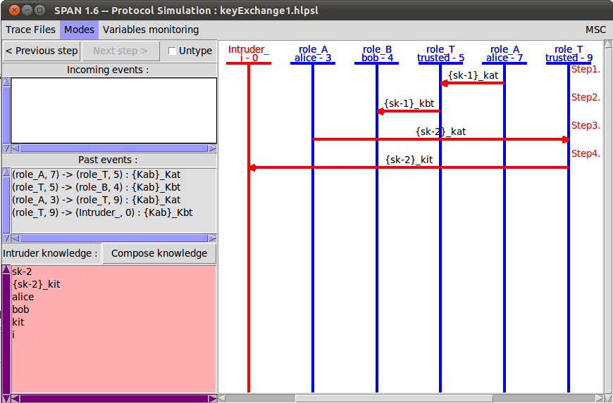
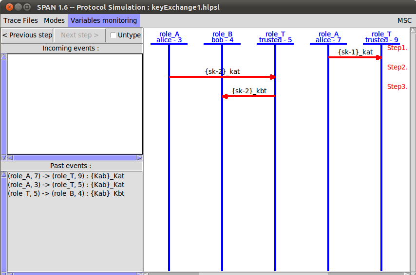
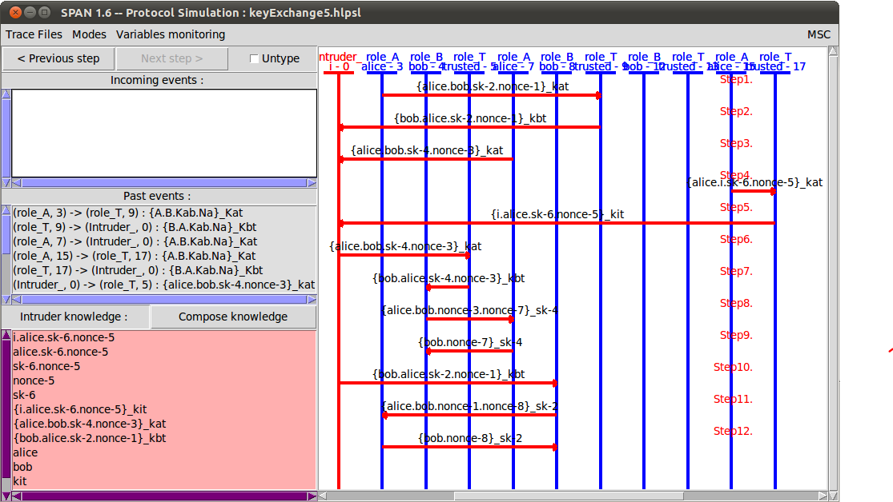
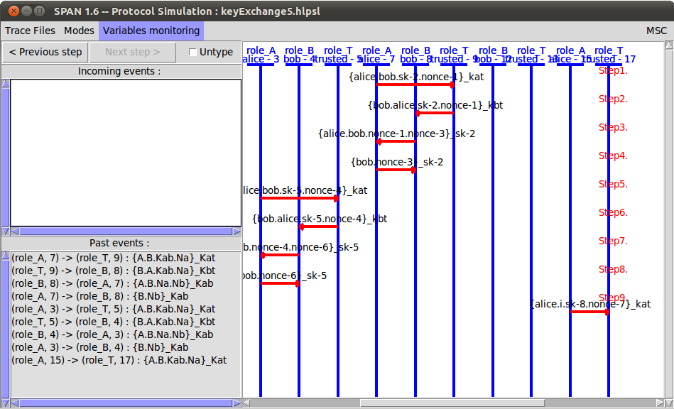
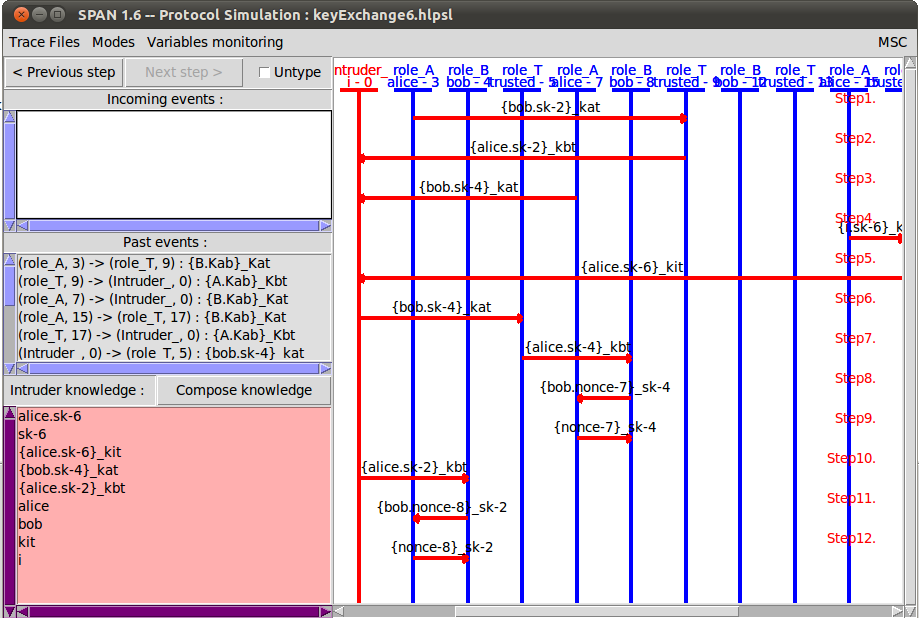
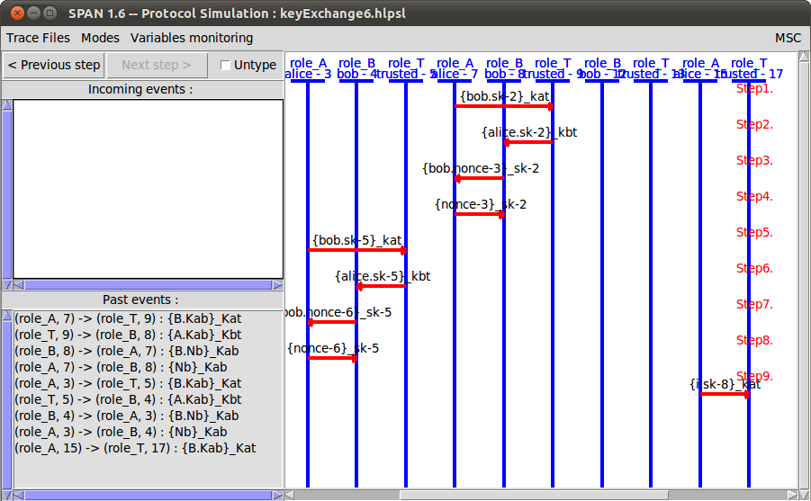

## Nirbhay Sharma (B19CSE114)
## Cyber security - Lab 

---

### **Explanation of the protocol**

- A has symmetric key: $K_{at}$
- T has symmetric key: $K_{at}, K_{bt}$
- B has symmetric key: $K_{bt}$

Goal: A needs to transfer $K_{ab}$ to B via a trusted party T

ALgorithm: the algorithm for key exchange is as follows
- first A encrypts the key $K_{ab}$ under $K_{at}$ (denoted by notation $\\{K_{ab}\\}$ _ $K_{at}$) and sends to T (trusted party) then T will decrypt $K_{ab}$ under key $K_{at}$ and encrypts again using $K_{bt}$ and sends it to B
- then B decrypts $K_{ab}$ under $K_{bt}$ and hence $K_{ab}$ is with B 
- the protocol is a very basic protocol and according the results generated by AVISPA-SPAN it is an UNSAFE protocol

### **Debugging of the code**

- to debug the code, the basic workflow is to check the transitions are triggered or not. and whichever transition is not triggered as expected then debug the code for the that transition.
- like for debugging the first error is to change state = 0 instead of state = 1 in role_A, this is because while simulating the protocol even the first transition is not happening between A and T so, by making state=0 we can change the code accordingly

final simuation after debugging of the code

  $\hspace{1cm}$  

### **Strengthing the protocol**

- the limitation of the first protocol was that, it is just passing key to T and T is passing key to B but this can be the possibility that an intruder can change the message and send to B and in this way this protocol can be breaked but to strengthen the protocol we need some method so that alice and bob can authenticate each other 
- so in addition to sending key, we are also authenticating alice and bob not in this way it is safe protocol according to AVISPA-SPAN tool 
- screenshots of protocol simulation are attached below

  $\hspace{1cm}$  

### **Optimizing the protocol**

- the previous protocol was SAFE but it incluces some redundant messages that we are sending, and without sending them also the protocol is safe
- so to optimize the protocol we need to remove some redundant messages from the above protocol by keeping the protocol safe
- so the idea is to do hit and trail, means to remove on message for authentication and check the protocol is SAFE or UNSAFE, if it is still safe it means that message we have removed is redundant, but if it becomes unsafe then we need to keep the message
- the screenshots of the protocol simulation for optmized protocol is shown below

  $\hspace{1cm}$  

---

