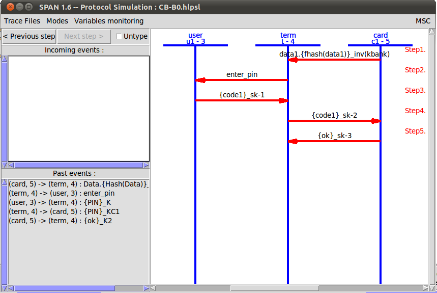
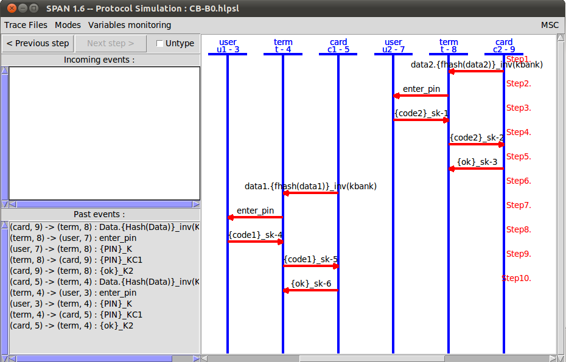
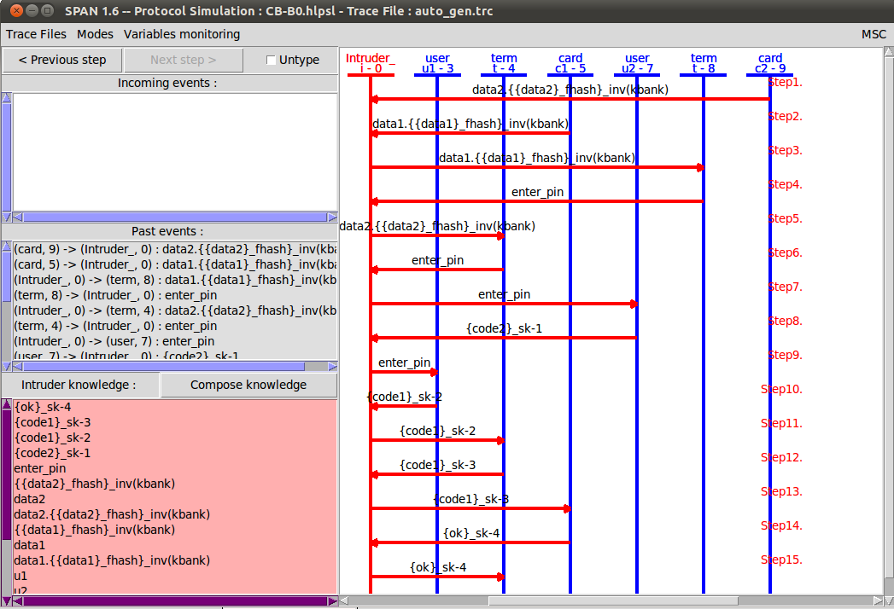
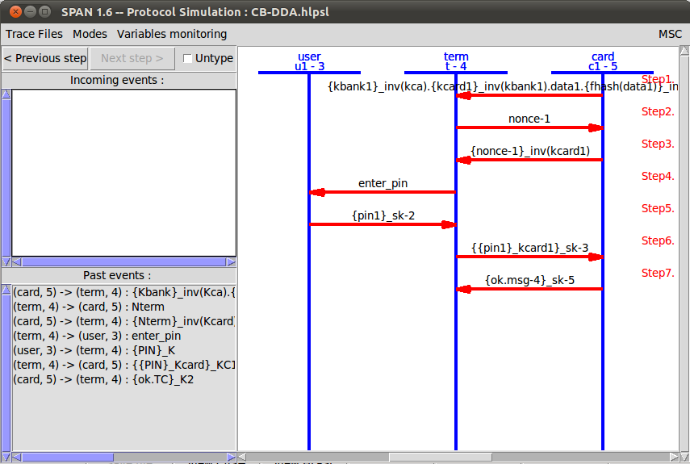
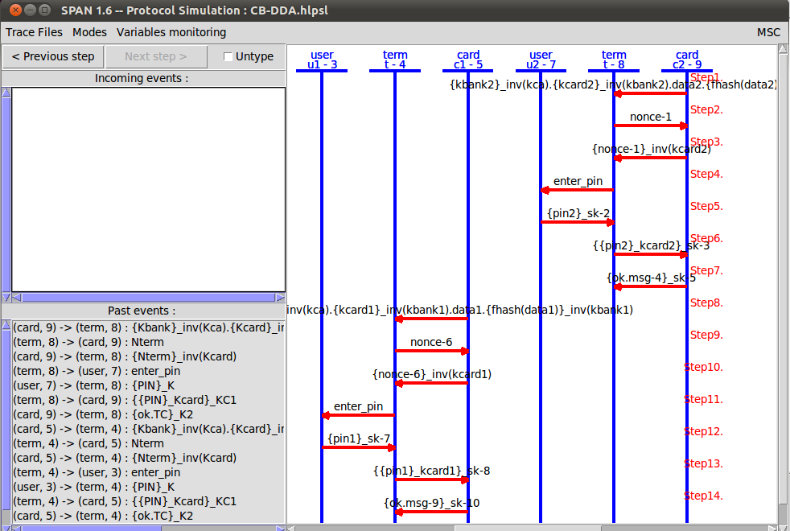

## Nirbhay Sharma (B19CSE114)
## Cyber security - Lab 

---
**CB-B0 protocol is used, which is the original credit card protocol**

### **First session with single terminal**

```hlpsl
session(u1, t, c1, kbank, fhash, Ksat1, Kstc1, data1, code1)
```
the protocol comes out to be SAFE according to AVISPA-SPAN  

<span>  </span>

**Explanation of the protocol**

- first the user inserts card to the terminal and hence terminal reads data from the credit card
- then terminal asks for the pin to user
- the user types pin (which is encrypted under a symmetric key (sk_1))
- the terminal receives a pin and sends its encrypted version to the credit card 
- and if the pin is correct the credit card returns **ok** to the terminal
- the user can proceed with the transaction

### **Both sessions with same terminal, different data and code**

```hlpsl
session(u1, t, c1, kbank, fhash, Ksat1, Kstc1, data1, code1) /\ session(u2, t, c2, kbank, fhash, Ksat2, Kstc1, data2, code2)
```
the model with 2 sessions with same terminal is UNSAFE as shown by AVISPA-SPAN

protocol and attack simulation of the protocol respectively

<span>    </span>

**Explanation of the protocol**

- this time the protocol is same just the difference is, we are using two different sessions on the same terminal and the user, card, data ,code all the parameters are different
- so in short two users will be there first the U2 will arrive and enter the pin and credit card sends ok signal to terminal 
- and then U1 will start and sends the pin and in in turn the terminal sends the pin to credit card (by encrypting it) and credit card verifies it and says ok
- basically it means the same as previous session but the difference only is two users are utilizing the same terminal one after the other
- the attack formulation is that an intruder which is listening, can capture both data2 and data1 and it can sends data1 to the termianl of user2 and sends data2 to the termianl of user1 after receiving the data the terminal prompts for pin and intruder sends the pin request then after the users will enter the pins and accordingly the intruder interrupts the pins sends the pin to terminal and receives another message from the terminal which it sends to the card and card gives ok signal which in turn intruder sends to terminal and in this way the intruder can easily access card of user1.
- so the attack is basically tapping the messages from term to user or card to term and manipulates the information sharing among them


**CB-DDA protocol is used**

**Explanation of the protocol**

- the protocol again is credit card protocol but this time it is a bit smart as it uses concept of nonce which is number that is used once 
- so when the card is inserted, terminal generate a nonce and sends it to the card and card in turn confirms the nonce and hence term and card can authenticate each other
- after authentication the same story resumes that terminal asks for pin, that user will enter and card will respond with ok message if the pin is correct

### **First session with single terminal**

```hlpsl
session(u1, t, c1, kca, kbank1, kcard1, fhash, Ksat1, Kstc1, data1, pin1) 
```
the protocol comes out to be SAFE according to AVISPA-SPAN  

<span>  </span>

### **Both sessions with same terminal, different data and code**

```hlpsl
session(u1, t, c1, kca, kbank1, kcard1, fhash, Ksat1, Kstc1, data1, pin1) /\ session(u2, t, c2, kca, kbank2, kcard2, fhash, Ksat2, Kstc1, data2, pin2)
```
the model with 2 sessions with same terminal is also SAFE in this case as shown by AVISPA-SPAN

protocol simulation is shown below

<span>    </span> 

---

<style> 

table, th, td {
  border: 0.1px solid black;
  border-collapse: collapse;
}

</style>

<script type="text/javascript" src="http://cdn.mathjax.org/mathjax/latest/MathJax.js?config=TeX-AMS-MML_HTMLorMML"></script>
<script type="text/x-mathjax-config">
    MathJax.Hub.Config({ tex2jax: {inlineMath: [['$', '$']]}, messageStyle: "none" });
</script>

