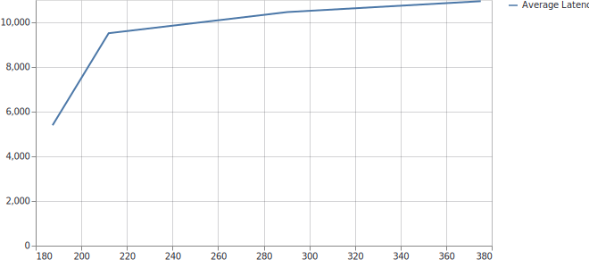
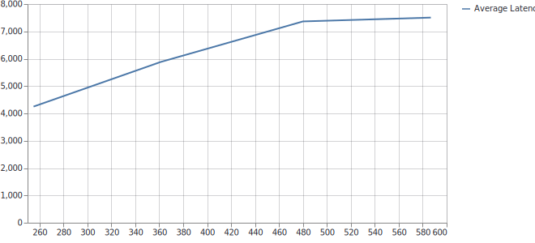
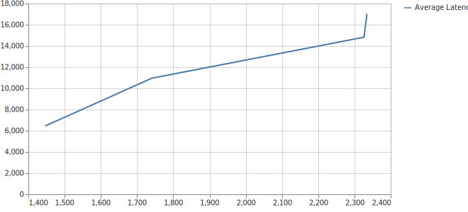
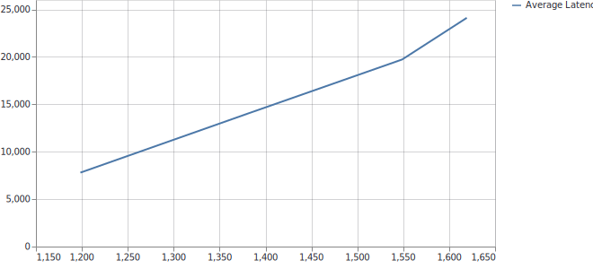
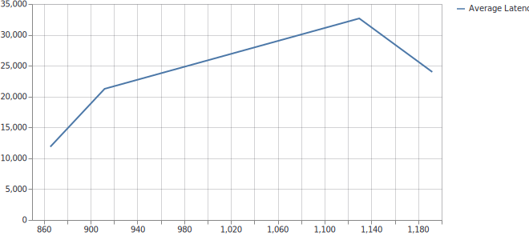
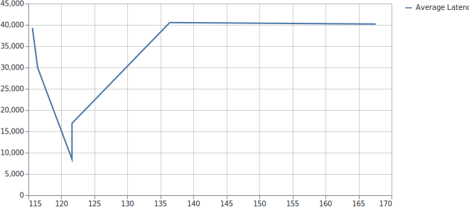
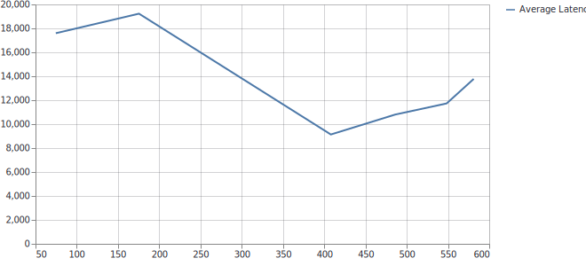
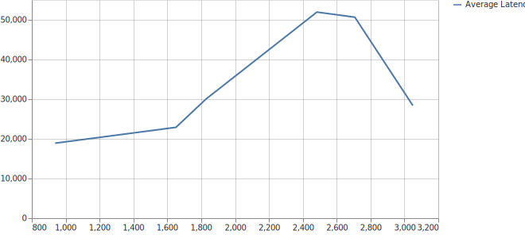
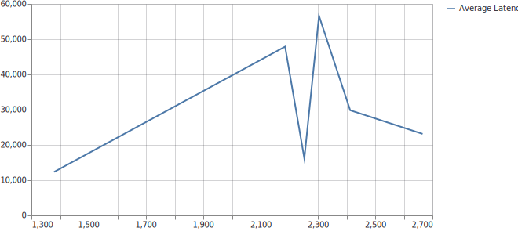
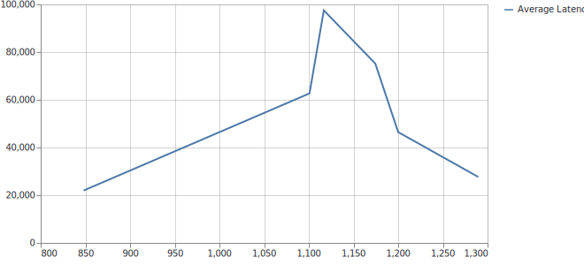

## Nirbhay Sharma (B19CSE114)
## DL-Ops - lab assignment - 4

---

**Testing on various values of batchsize and concurrency endpoint**

|Model|Batchsize|Concurrency range|Throughput|Latency|
|---|---|---|---|---|
|torch|8|4|370|5300|
|onnx|8|4|590|4200|
|tensorrt 32|8|4|2350|6100|
|tensorrt 16|8|4|1625|7500|
|tensorrt 8|8|4|1200|12100|

**Latency vs Throughput curve for torch, onnx, fp32, fp16, fp8 respectively**

     

|Model|Batchsize|Concurrency range|Throughput|Latency|
|---|---|---|---|---|
|torch|16|6|168|8000|
|onnx|16|6|580|9100|
|tensorrt 32|16|6|3050|19900|
|tensorrt 16|16|6|2680|12000|
|tensorrt 8|16|6|1295|22000|

**Latency vs Throughput curve for torch, onnx, fp32, fp16, fp8 respectively**

     

**Note: the values in table are mentioned as lowest latency and highest throughput**

---
