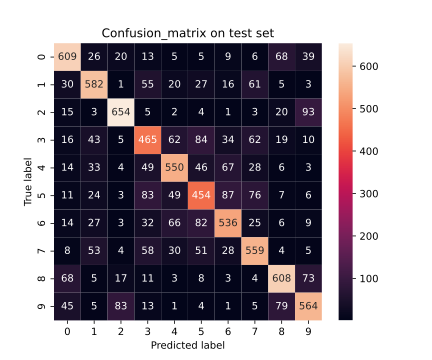
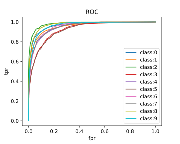
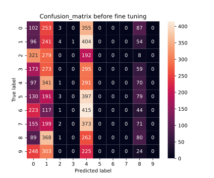
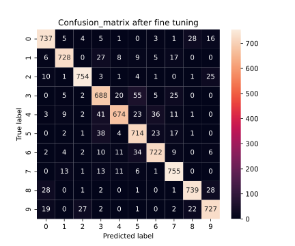
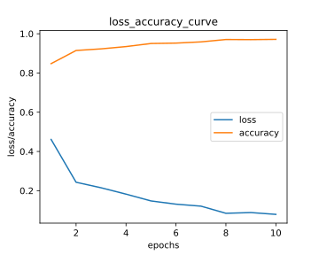
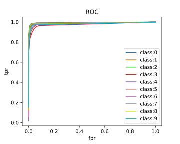
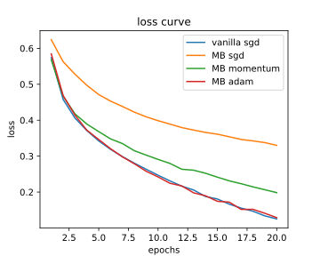

## Nirbhay Sharma (B19CSE114)
## Deep Learning - Assignment -2

---

**Que -1**. code for multiclass svm's + finetuning of RESNET50 and all other evaluation matrix from scratch is provided in the given .ipynb file 

*part-1*. the results are given below:
- accuracy on test set for multiclass svm - $0.697$
- confusion_matrix and roc_curve on test set:
<!--  -->
   
        

<!--  -->
*part-2*. **`[bonus]`**
- comparison

||accuracy|classwise accuracy|confusion_matrix|
|---|---|---|---|
|before finetuning|$0.09$|[0.12, 0.30, 0, 0, 0.36, 0, 0, 0, 0.1, 0]||
|after finetuning|$0.90$|[0.92, 0.91, 0.94, 0.86, 0.84, 0.89, 0.90, 0.94, 0.92, 0.90]||

- loss_accuracy and roc_curve curve after finetuning of resnet50 

   

**Que-2**. code for the evaluation and training of models is given in .py and .ipynb files

- comparison among 4 metrics (accuracy, precision, recall, f_score) with various experiments on densenet121 and resnet18

|Model|Loss_function|accuracy|precision|recall|f_score|
|---|---|---|---|---|---|
|Densenet121|triplet_loss + Crossentropy|$0.470$|$0.495$|$0.469$|$0.462$|
|Densenet121|cross_entropy_loss|$0.478$|$0.501$|$0.478$|$0.476$|
|Resnet18|triplet_loss + SVM|$0.326$|$0.318$|$0.326$|$0.318$|
|Resnet18|cross_entropy_loss|$0.438$|$0.450$|$0.438$|$0.434$|
|Resnet18|center_loss|$0.431$|$0.454$|$0.431$|$0.432$|

- various experiments has been performed using densenet121 and resnet18 with tinyimagenet data on various loss functions and techniques. first thing to observe is that densenet121 has higher metrics (accuracy, precision, recall, f_score) possible reason may be because it has a very dense network and also it utilizes the skip connections, so it would be able to learn better.
- densenet121 is trained on combination of triplet-loss and cross-entropy-loss, so due to triplet loss it learns to identify features well and due to cross-entropy-loss it learns to assign classes to the embeddings.
- resnet18 is also trained using triplet-loss and SVM, first triplet-loss is used to train the network for embeddings and then SVM is used to train the embeddings against classes
- resnet18 is also trained on combination of center-loss and cross-entropy-loss, again cross-entropy-loss is to train models against ground truth labels
- On comparing resnet18 in terms of all the losses, we can observe that it gives best performance in case of cross_entropy_loss, possible reason may be that triplet-loss and center-loss may require more epochs of training ($\sim 200$), only after that much huge number of epochs it should be able to separate the classes well and then it would also increase the performance of model in correct classification.

**Que-3**. code for the comparison is given in .py file

- comparison among all the 4 optimizers in terms of loss function

<!--  -->

- comparison in terms of accuracy

|optimizer|test_accuracy|train_accuracy|
|---|---|---|
|vanilla sgd|$0.684$|$0.953$|
|minibatch + sgd|$0.838$|$0.861$|
|minibatch sgd + momentum|$0.880$|$0.920$|
|minibatch + adam|$0.885$|$0.951$|

we can see in <a href='#img_loss'>loss_figure</a> that the loss for vanilla sgd and MiniBatch (MB) + Adam decreases loss more as compared to MB sgd or MB with momentum but accuracy wise if we see, then best accuracy is achieved by MB with adam and also we can observe that minibatch sgd with momentum also performs equivalent to MB + adam, vanilla sgd does not perform well in terms of accuracy possibly because batch size here is 1 so it would not be able to learn the distribution well rather it memorize the distriubution (overfitting), MB + sgd on the other hand performs well as it utilize minibatch so it may learn the distribution well. 

    
---

