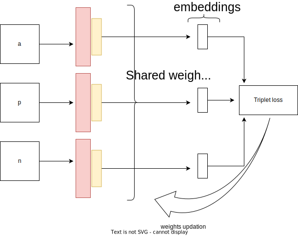

## Nirbhay Sharma (B19CSE114)
## Deep Learning (CSL4020) - End-Sem Exam

---

1. Finding researh paper 

- DD/MM/YY = 18/03/03
- AGE = 19
- ABC = 114
- FIRST_NAME = NIRBHAY (COUNT = 7)
- LAST_NAME = SHARMA (COUNT = 6)

```
m1 = 1
m2 = 0
m3 = 1
m4 = 0
m5 = 0
m6 = 0
m7 = 1
m8 = 1
m9 = 0

G = [   
    1 0 1
    0 0 0
    1 1 0
]
number_of_ones = 4
```

paper selecting algorithm
```py
def paper_selection(no_of_ones):
    if (no_of_ones > 5): return 4
    if (no_of_ones > 3): return 3
    if (no_of_ones > 1): return 2
    else: return 1
```

according to above paper_selection algorithm I am allocated to paper_id **$3$**


2. Paper_id (=3) (https://arxiv.org/pdf/1802.05957.pdf)

**part-a**

1. As far as GAN architectures are concerned, they are very instable while training and it's hard to make them converge and GAN's are also very sensitive to hyperparameters such as lr, epochs etc. so it becomes important to develop some techniques that can stabalize the GAN's training and make them converge in a more stable manner. The authors of the paper "SPECTRAL NORMALIZATION FOR GENERATIVE ADVERSARIAL NETWORKS" proposes a normalization method to train GAN's in a much more stable way. We generally use normalization methods in deep neural nets so as to maintain a distribution in the entire training process, on the similar line the authors are proposing an another normalizing method which is spectral normalization and their architecture for experiments is as follows

**architecture details**

- In the paper the authors mention that they are using naive GAN architectures which uses convolution layers as building blocks for both generator and discriminator and they are also using the same naive GAN loss function which is $log(D(x)) + log(1 - D(G(x)))$, apart from that, they are using their proposed method i.e spectral normalization in their architecture and based on that, they are reporting comparative results based on using various normaliztion method like batch normalization, layer normaliztion, and their propsed method i.e. spectral normalization

**Lipschitz Condition**

for a given function $f$ we can call it lipschitz continuous if for every $x,y$ we have 
$$
\\|f(x) - f(y)\\| \le L\\|x-y\\|
$$

and L called as $Lip(f)$ and is named as lipschitz constant

**spectral normalization**

- it is a normalization technique proposed by authors which normalizes a matrix as follows

$$
W_{SN} = \frac{W}{\sigma (W)}
$$

where $\sigma(W)$ is $Lip(W)$ or lipschitz constant of $W$ and which can also be interpreted as largest singular value for W.

**singular value**

for a matrix W, singular value is the square root of eigen values of the matrix $WW^T$ i.e $s = \sqrt{eigen(WW^T)}$

and the fact is that the $Lip(W_{SN})$ is 1 and in that sense it is considered as normalized

**benefits of above method**
- In the paper the expreiments shows that the spectral normalization techinique is indeed training the generative adversarial network in a stable manner
- other benefits that authors mentioned in the paper includes the spectral normalization method can also be done without learning its only hyperparameter which is lipschitz constant and so in that sence it has now even less computation overhead
- other benefit that is claimed in the paper is that the spectral normalization is independent of the rank of W matrix and hence the weight matrix can learn as many features as it wants without violating the lipschitz conditions

**backpropagation and weight updates**

- since this is a basic gan architecture the loss would backpropagate in the naive manner, like first calcuate the derivative of loss wrt weight values and update using gradient descent algorithm which is 


$$
\triangledown W = - \eta \frac{\partial L}{\partial W}
$$

just one thing that we need to take care of while calculating gradients is the backpropagation at the spectral normalization layer i.e. we need to calculate error that is backpropagated through the spectral norm layer in the network for which the equations are shown below, from division rule of differentiation we get

$$
\frac{\partial W_{SN}}{\partial w_{ij}} =  \frac{\sigma(W)\frac{\partial W}{\partial w_{ij}} - W\frac{\partial \sigma(W)}{\partial w_{ij}}}{(\sigma(W))^2}
$$

now other two equations arise from this are 

$$
\frac{\partial W}{\partial w_{ij}} = e_{ij}
$$

where $e_{ij}$ has the same size as W but it has 0 at all values expect for ith row and jth column which is filled with 1, since at that position only the derivative is $\frac{\partial w_{ij}}{\partial w_{ij}}$ and on rest other place it is $\frac{\partial w_{kl}}{\partial w_{ij}}$ where k,l cannot simultaneously be equal to i,j

$$
\frac{\partial \sigma(W)}{\partial w_{ij}} = {UV^T}_{ij}
$$

to find above equations we need to consider the singular value decomposition of the matrix W which is $UWV^T$ where U is the left singular matrix and V is the right singular matrix and from that we can find the derivative of $\sigma(W)$ using the matrix U and V

the official implementation of spectral norm in pytorch can also be found [here](https://pytorch.org/docs/stable/generated/torch.nn.utils.parametrizations.spectral_norm.html)

**part-b**

2. The network as given in the above paper is a simple GAN architecture with an optimization of using spectral normalization, so an improvement in the design and a new loss function is presented below

- first consider the fact that the main task of discriminator is to differentiate between real and fake images, so an inspiration can be also taken from siamese networks and triplet loss function, and try to relate both of them in the following way
- since siamese network's main task is to maximize the interclass distance and minimize the intra class distance in a similar manner the discriminator also tries to minimize the real-real class distance and maximize the real-fake class distance in siamese fashion
- so the updated loss functions for discriminator and generator are

    Proposed Discriminator loss function     
    $$
    L(D) = \\|D(x) - D(y)\\|^2 - \\|D(x) - D(G(x))\\|^2 + \alpha 
    $$

    Proposed generator loss function
    $$
    L(G) = \\| D(G(x)) \\|^2
    $$

    to add upon this the loss function are prepared as follows
    - discriminator tries to minimize the real-real class distance and maximize the real-fake class distance and since generator tries to fool the discriminator it tries to maximize $\\| D(G(x)) \\|$ so that discriminator cannot understand the clusters of real and fake classes and for that matter the generator loss is kept same as before
    - to use this loss function the architecture of discriminator requires slight modification based on the fact that now in discriminator, two real images and fake(generated) images are passed in the form of triplet (x,y,G(x)) and instead of binary classification we need to understand the feature embeddings of both real and fake classes and discrminator task is to separate real and fake embeddings in feature space and generator task is to do just opposite of it i.e. it tries to maximize the fake embeddings, so its again a min-max game where discriminator loss needs to be minimized and generator loss needs to be maximized but in siamese fashion.
    - the loss function seems to perform good in terms of competition that happens between discriminator and generator, each time when the discriminator gets better the generator loss starts decreasing and so generator will try to maximize its loss which in turn also increase discriminator loss and again discriminator needs to update the weights so in this alternate iterative fashion the generator and discriminator gets trained
    - the one drawback of this loss function is computation overhead since now we need to do one extra forward pass in case of discriminator due the third real image that we are giving input to discriminator.

    **backpropagation and weight updation**

    the backpropagation is same as the previous one just we need to make loss derivative wrt. weight values and updates the weights using the equation
    
    $$
    \triangledown W = - \eta \frac{\partial L}{\partial W}
    $$

    so to calcuate $\frac{\partial L}{\partial W}$ we can do the following step

    for discriminator

    $$
    \frac{\partial L(D)}{\partial W} = \frac{\partial L(D)}{\partial D(x)} \frac{\partial D(x)}{\partial W} + \frac{\partial L(D)}{\partial D(y)} \frac{\partial D(y)}{\partial W} + \frac{\partial L(D)}{\partial D(G(x))} \frac{\partial D(G(x))}{\partial W}  
    $$

    for generator

    $$
    \frac{\partial L(G)}{\partial W} = \frac{\partial L(G)}{\partial D(G(x))} \frac{\partial D(G(x))}{\partial W}
    $$

    and accordingly further derivaties are calculated in a straightforward manner and in turn train the entire network


3. In the course (CSL4020) we studied various architectures like (GAN, Autoencoder, Siamese, RNN) and loss functions like (MSELoss, Crossentropy loss, Center loss, Triplet margin loss, min-max loss (GAN loss)) etc. out of which Triplet loss and Siamese network is a popular combination for learning inter-class and intra-class variations of an image.

    **triplet loss**
    
    mathematical expression of triplet loss is 

    $$
    L(a,p,n) = \sum_{i=1}^{N} {\left[ \\|f_i^a - f_i^p \\|^2 - \\|f_i^a - f_i^n \\|^2 + \alpha \right]}
    $$

    - the loss basically is trying to reduce the intra-class distance ($f_i^a, f_i^p$) and at the same time tries to maximize the inter class distance ($f_i^a, f_i^n$) and that's why we have two expressions to minimize ($\\|f_i^a - f_i^p \\|^2$) and ($ - \\|f_i^a - f_i^n \\|^2$)

    **siamese-network**
    - siamese-networks basically tries to learn the features of the image and based on that learned embeddings it tries to learn inter class and intra class variations using triplet loss function or some other distance loss functions a flow of siamese network is shown below

    

    - from above figure it is clear that the siamese network is a shared weight, shared architecture network and its weights are updated using triplet loss function and in this manner it will learn the inter class and intra class features

    **backpropagation equations and weight updation**

    - let us consider the input to the siamese network is a triplet $(a,p,n)$ and we are passing those anchor (a), positive (p), negative (n) images to the same siamese network to find embeddings $(f(a), f(p), f(n))$ (where $f()$ is the siamese network), which are then passed to the triplet loss function now the backpropagation step comes when we need to find the derivative of loss function w.r.t. weight values and then update the weights using gradient descent method
    - as it is clear that loss function is a function of $(f(a), f(p), f(n))$ so loss can be represented as follows: (G represents a function) 
    
    $$
    L = G(f(a),f(p),f(n))
    $$  

    now calculate its derivative with respect to the weight values 

    $$
    \frac{\partial L}{\partial W} = \frac{\partial G(f(a),f(p),f(n))}{\partial W} 
    $$

    now since f(a), f(p), f(n) are dependent on W, since they are coming from same shared weight network so by using chain rule we get

    $$
    \frac{\partial L}{\partial W} = \frac{\partial L}{\partial f(a)} \frac{\partial f(a)}{\partial W} + \frac{\partial L}{\partial f(p)} \frac{\partial f(p)}{\partial W} + \frac{\partial L}{\partial f(n)} \frac{\partial f(n)}{\partial W}  
    $$

    now $\frac{\partial f(i)}{\partial W}$ can be calculate for all $i \in \\{a,p,n\\}$ and further the derivative is calculated to find their values.

    and $\frac{\partial L}{\partial f(a)}$ can be calculated easily using following equations

    $$
    L = \left[ \\|f(a) - f(p) \\|^2 - \\|f(a) - f(n) \\|^2 + \alpha \right]
    $$

    $$
    \frac{\partial L}{\partial f(a)} = 2 |f(a)- f(p)| - 2 |f(a) - f(n)|
    $$

    $$
    \frac{\partial L}{\partial f(p)} = -2 |f(a)- f(p)|
    $$

    $$
    \frac{\partial L}{\partial f(n)} = 2 |f(a) - f(n)|
    $$

    and final weight update step includes

    $$
    W = W - \eta \frac{\partial L}{\partial W}
    $$

    In this fashion weight updates are done using siamese network and triplet loss
---

<style> 

table, th, td {
  border: 0.1px solid black;
  border-collapse: collapse;
}

</style>

<script type="text/javascript" src="http://cdn.mathjax.org/mathjax/latest/MathJax.js?config=TeX-AMS-MML_HTMLorMML"></script>
<script type="text/x-mathjax-config">
    MathJax.Hub.Config({ tex2jax: {inlineMath: [['$', '$']]}, messageStyle: "none" });
</script>