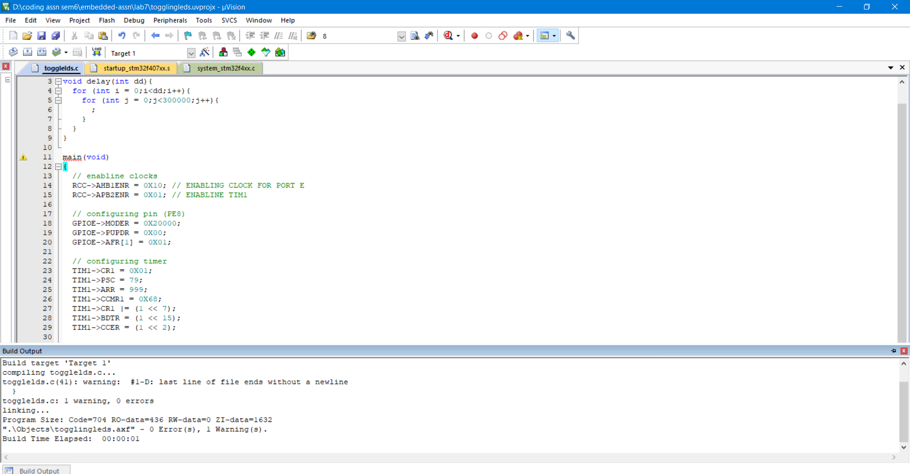

## Nirbhay Sharma (B19CSE114)
## Digital Systems Lab - 10

---

**Task-1**

```c
#include "stm32f4xx.h"

main(void)
{
  // enabline clocks
	RCC->AHB1ENR = 0X10; // ENABLING CLOCK FOR PORT E
	RCC->APB2ENR = 0X01; // ENABLINE TIM1

	// configuring pin (PE8)
	GPIOE->MODER = 0X20000;
	GPIOE->PUPDR = 0X00;
	GPIOE->AFR[1] = 0X01;

	// configuring timer
	TIM1->CR1 = 0X01;
	TIM1->PSC = 79;
	TIM1->ARR = 999;
	TIM1->CCMR1 = 0X68;
	TIM1->CR1 |= (1 << 7);
	TIM1->BDTR = (1 << 15);
	TIM1->CCER = (1 << 2);
	
	TIM1->CR1 |= 0X01; 
	while(1){
		TIM1->CCR1 = 500;
	}
}
```

**code-explanation**

- first enable GPIOE and TIM1 using RCC$\to$AHB1ENR and RCC$\to$APB2ENR respectively
- configure pin 8 of GPIOE to alternate function mode (10) so getting 0x20000
- configure pullup pull down register also
- now set GPIOE$\to$AFRH 0th pin to 0001 (AF1) mode for TIM1 and code wise we write GPIOE$\to$AFR\[1\] = 0X01 
- now setting psc and arr value using formula 
	$$f_{clkout} = \frac{f_{clkin}}{(psc+1)(arr+1)}$$
	$$100 HZ = \frac{8 \times 10^6 HZ}{(psc+1)(arr+1)}$$
	$$(psc+1)(arr+1) = 8 \times 10^4$$
	$$(psc+1)(arr+1) = 80000$$ 
	so choosing the appropriate value for psc and arr and I choose psc = 79 and arr = 999
- now setting up cr1 and bdtr (setting MOE) registers and ccer regsiters
- now run a while loop and makde ccr1 = 500 since we want 50% duty cycle
	$$DutyCycle = \frac{CCR}{ARR+1}$$
	$$0.5 = \frac{CCR}{(999+1)}$$ 
	$$0.5 = \frac{CCR}{1000}$$
	$$CCR = 500$$ 

**build-output**


**Task-2**

```c
#include "stm32f4xx.h"

void delay(int dd){
	for (int i = 0;i<dd;i++){
		for (int j = 0;j<300000;j++){
			;
		}
	}
}

main(void)
{
  // enabline clocks
	RCC->AHB1ENR = 0X10; // ENABLING CLOCK FOR PORT E
	RCC->APB2ENR = 0X01; // ENABLINE TIM1

	// configuring pin (PE8)
	GPIOE->MODER = 0X20000;
	GPIOE->PUPDR = 0X00;
	GPIOE->AFR[1] = 0X01;

	// configuring timer
	TIM1->CR1 = 0X01;
	TIM1->PSC = 79;
	TIM1->ARR = 999;
	TIM1->CCMR1 = 0X68;
	TIM1->CR1 |= (1 << 7);
	TIM1->BDTR = (1 << 15);
	TIM1->CCER = (1 << 2);
	
	TIM1->CR1 |= 0X01;

	int tim_values_terms = 7; 
	int tim_values[] = {200, 300, 500, 400, 900, 800, 600};
	int i = 0;
	while (1) {
		TIM1->CCR1 = tim_values[i];
		i = (i + 1) % tim_values_terms;
		delay(1200);
	}  
}
```

**code-explanation**

- first enable GPIOE and TIM1 using RCC$\to$AHB1ENR and RCC$\to$APB2ENR respectively
- configure pin 8 of GPIOE to alternate function mode (10) so getting 0x20000
- configure pullup pull down register also
- now set GPIOE$\to$AFRH 0th pin to 0001 (AF1) mode for TIM1 and code wise we write GPIOE$\to$AFR\[1\] = 0X01 
- now setting psc and arr value using formula 
	$$f_{clkout} = \frac{f_{clkin}}{(psc+1)(arr+1)}$$
	$$100 HZ = \frac{8 \times 10^6 HZ}{(psc+1)(arr+1)}$$
	$$(psc+1)(arr+1) = 8 \times 10^4$$
	$$(psc+1)(arr+1) = 80000$$ 
	so choosing the appropriate value for psc and arr and I choose psc = 79 and arr = 999
- now setting up cr1 and bdtr (setting MOE) registers and ccer regsiters
- now run a while loop and change ccr1 from an array in order to get PWM output of various duty cycles, so suppose we want $x %$ dutycycle
	$$DutyCycle = \frac{CCR}{ARR+1}$$
	$$\frac{x}{100} = \frac{CCR}{(999+1)}$$ 
	$$\frac{x}{100} = \frac{CCR}{1000}$$
	$$CCR = 10x$$
- now changing various $x$ we get various values for duty cycle and we can put them in an array and change it in while loop 

**build-output**



**Task-3**

**part-1**


- In this code there are two tasks, TaskDigitalRead, TaskAnalogRead
- so the semaphore here is trying to maintain synchronization between digital read and analog read
- the segment of code given below
	```
	if ( xSemaphoreTake( xSerialSemaphore, ( TickType_t ) 5 ) == pdTRUE )
    {
      Serial.println(buttonState);

      xSemaphoreGive( xSerialSemaphore ); // Now free or "Give" the Serial Port for others.
    }
	```

	from above code we can see that each task first try to take semaphore (i.e. decrease it's value) if it is available the task is free to do it's task and once it's task completes it give the semaphore back (i.e. increment its value)

- and hence synchronization is created using a binary semaphore here


**part-2**


- just like previous part, this part also has two tasks, Ledon, Ledoff
- so here also we are using binary semaphore to maintain synchronization between ledon and off operations, which means that no two process should make led on and off at the same time
- here it is using interrupts to give the semaphore (increment it) and every process once started, take the semaphore (decrement it) and was given back using interrupts which is handled by interrupt handler

---

<style> 

table, th, td {
  border: 0.1px solid black;
  border-collapse: collapse;
}

</style>

<script type="text/javascript" src="http://cdn.mathjax.org/mathjax/latest/MathJax.js?config=TeX-AMS-MML_HTMLorMML"></script>
<script type="text/x-mathjax-config">
	MathJax.Hub.Config({ tex2jax: {inlineMath: [['$', '$']]}, messageStyle: "none" });
</script>