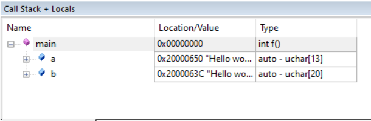
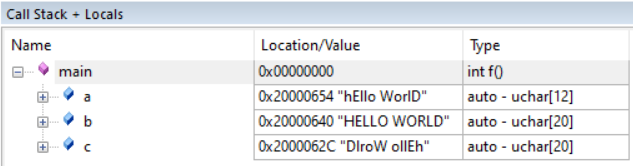
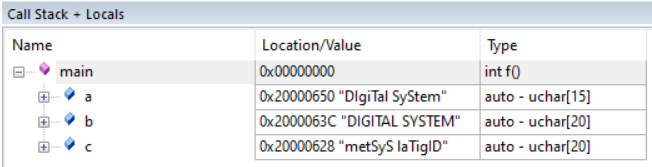
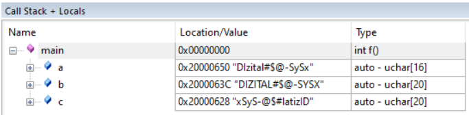

## Nirbhay Sharma (B19CSE114)
## Digitial systems lab - 6
---

**Task1**

- output of the simulation is presented here
  - 

**Task2**

```c
#include<stdio.h>
#include<stdlib.h>
#include<string.h>
#include "stm32f4xx.h"

__asm void your_strcpy(const char *src, char *dst){
	
loop
	LDRB r2, [r0], #1 
	STRB r2, [r1], #1 
	CMP r2, #0 
	BNE loop 
	BX lr 
}

__asm void your_capitalise(const char *src, char *dst){
	
loopmain
	LDRB r2, [r0], #1
	CMP r2,#97
	blt asitis
	CMP R2,#122
	BGT asitis
	SUB r2,r2,#32
	STRB r2, [r1], #1 
	CMP r2, #0 
	BNE loopmain 
	BX lr 
	
asitis
	STRB r2, [r1], #1 
	CMP r2, #0 
	BNE loopmain
	BX LR
}


__asm void your_reverse(const char *src, char *dst){
	
main
	mov r6,r0
	mov r7,lr
	push {r0,LR}
	BL getlen
	POP {R0,LR}
	sub r4,r4,#1
	add r0,r0,r4
	
reverse
	LDRB r2,[r0],#-1
	sub r4,r4,#1
	strb r2,[r1],#1
	cmp r4,#-1
	beq endrev
	b reverse

endrev
	mov r2,#0x0
	strb r2,[r1]
	bx LR

getlen
	LDRB r2,[r0],#1
	CMP r2,#0
	BNE contgetlen
	BX LR
	
contgetlen 
	ADD R4,R4,#1
	B getlen
}


int main(void){
	//const char a[] = "hEllo WorlD";
	//const char a[] = "DIgiTal SyStem";
	const char a[] = "DIzital#$@-SySx";
	char b[20];
	char c[20];
	//your_strcpy(a, b);
	your_capitalise(a,b);
	your_reverse(a,c);
	while (1);
	return 0;
}

```

Please Note that output of 1st question is stored in **b** and output of 2nd question is stored in **c**

Testing on Multiple inputs
- 
- 
- 


**logic for que-1:**
- first store the value of a char in r2 and then check if its ascii value is less than 97 (ascii of a) and greater than 122 (ascii of z) if it stisfies the above condition then leave it as it is since it is not a small alphabet but if its ascii value lies between 97 and 122 then make it capital 
  
**logic for que-2:**
- first get the length of the string to be reversed
- then iterate over the string in reverse manner and store each byte in destination address and at last add 0x0 to end the string

