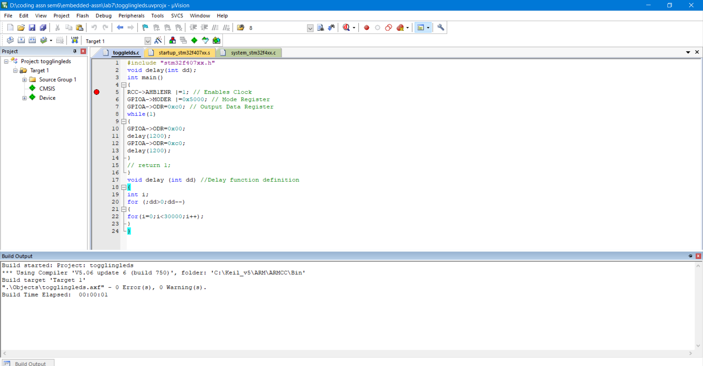
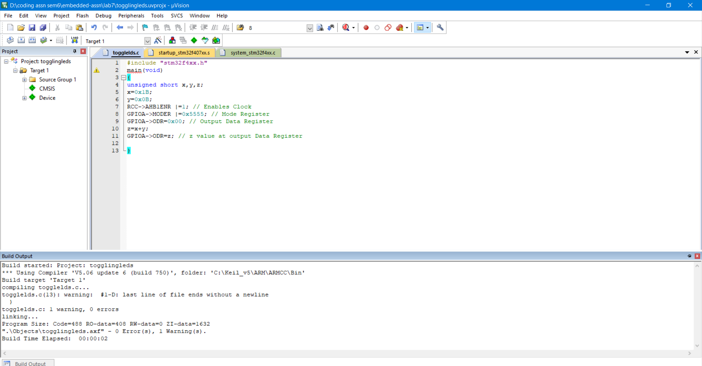
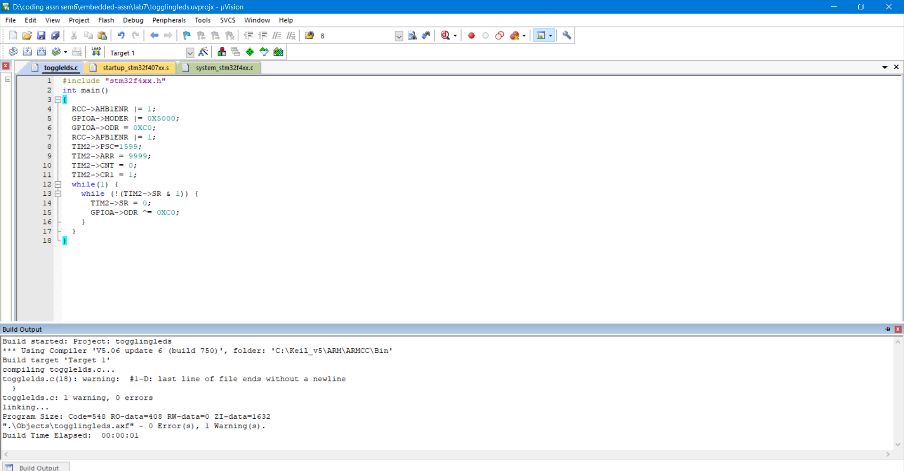
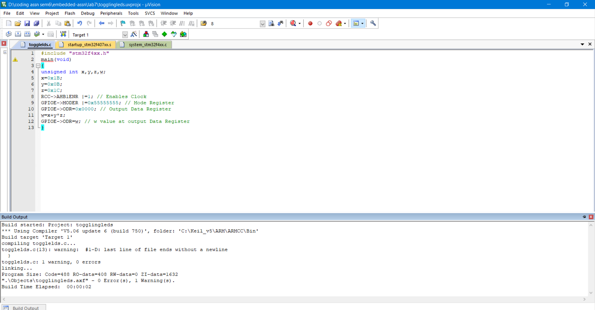

## Nirbhay Sharma (B19CSE114)
## DSL - Lab - 7

---

### **Simulation Of Programs**

**part1**



**part2**



**part3**




1. if we expand 0xc0 then it comes out to be 11000000, observe that 6th and 7th pin is high, it means that we are enabling pin 6 and pin 7, as required

2. if we expand 0x5000 then it comes out to be (01 01 00 00 00 00 00 00), each of them represents 2 bits and notice that 6th and 7th pin is set to 01, which means that they are getting high for output mode

3. if we change 30000 to 50000 then delay(1200) would be more for same value (1200), which means that led's will blink after more dealy

4. yes, there is one typo in the program i.e GPIOB->ODR = Z, because we want output to be at GPIOA and not GPIOB 

5. Since, x and y both are of 8 bits and so z would be of 8 bits so we need 8 output moder pins to display the output of led's so we set it to 0x5555 (01 01 01 01 01 01 01 01) it directly means that 8 pins are set to output mode (01) to display ouput of led's 

6. code is presented below
```c
#include "stm32f4xx.h"
main(void)
{
unsigned int x,y,z,w;
x=0x1B;
y=0x0B;
z=0x1C;
RCC->AHB1ENR |=1; // Enables Clock
GPIOE->MODER |=0x55555555; // Mode Register
GPIOE->ODR=0x0000; // Output Data Register
w=x+y*z;
GPIOE->ODR=w; // w value at output Data Register
}
```

- logic for code is that since there are 3, 8 bit integers so we want 16 bit output so all the 16 bits of odr needs to be initialized with 0 and all 32 bit of moder register is to be set to 01 (GPIO output mode) so it is set to 0x55555555 now we calculate the value of w $(x + y * z)$ and assign it to odr to get the output on all the 16 bits. and since we need to give ouput at port E, thats why GPIOE is used.

- build ouput for the code is shown below-:



7. the prescalar value is chosen in such a manner that output clock frequency satisfies a particular equation i.e.
$$f_{ckcnt} = \frac{f_{cLpsc}}{psc + 1}$$
so psc is choose to be 1599 so that $f_{ckcnt}$ which is ouput frequency is a particular value that we want so we divide $f_{cLpsc}$ by (1599 + 1) i.e. 1600

8. Since we have a delay of 1s $\simeq$ 1000ms and though ARR value is delay - 1 so arr = 1000 - 1 = 999 and not 9999

--- 

<script type="text/javascript" src="http://cdn.mathjax.org/mathjax/latest/MathJax.js?config=TeX-AMS-MML_HTMLorMML"></script>
<script type="text/x-mathjax-config">
    MathJax.Hub.Config({ tex2jax: {inlineMath: [['$', '$']]}, messageStyle: "none" });
</script>


