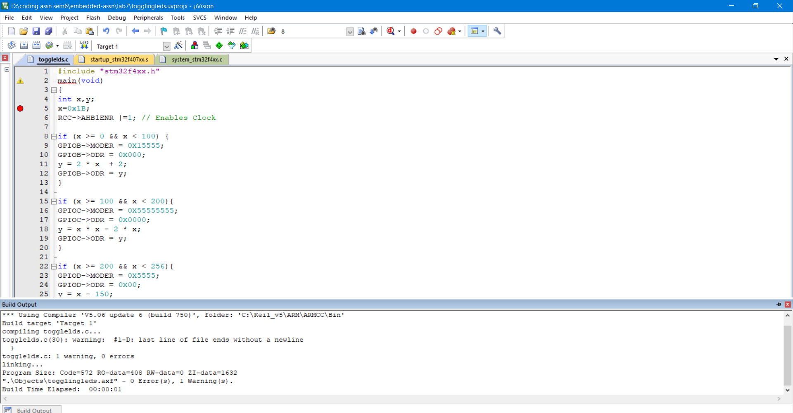

## Nirbhay Sharma (B19CSE114)
## DSL - Lab - 8

---

### **Que-1**

```c
#include "stm32f4xx.h"
main(void)
{
int x,y;
x=0x1B;
RCC->AHB1ENR |=1; // Enables Clock

if (x >= 0 && x < 100) {
GPIOB->MODER = 0X15555;
GPIOB->ODR = 0X000;
y = 2 * x  + 2;
GPIOB->ODR = y;
}

if (x >= 100 && x < 200){
GPIOC->MODER = 0X55555555;
GPIOC->ODR = 0X0000;
y = x * x - 2 * x;
GPIOC->ODR = y;
}

if (x >= 200 && x < 256){
GPIOD->MODER = 0X5555;
GPIOD->ODR = 0X00;
y = x - 150;
GPIOD->ODR = y;
}


}
```

#### **code-explanation**
- first we are enabling the clock
- then we are applying conditions on x and based on the three conditions we are assigning values to ports
- $(0 \le x < 100)$ first we are setting moder value to (0001 0101 0101 0101 0101) which is $0x15555$ the last 1 is due to overflow since $2x$ can also be 9 bit number if x is 8 bit number. and then the calculated value is send to ODR
- $(100 \le x < 200)$ here the value is $x^2 - 2x$ which can be maximum 16 bits so all the moders of port B is set to output mode
- $(200 \le x < 256)$ here the value is $x - 150$ which is confined to 8 bits only so to support that only $0x5555$ is sufficient and the output is send to odr

#### **build-output**



### **Que-2**

#### **code-explanation**

#### **build-output**

### **Que-3**

#### **code-explanation**

#### **build-output**

### **Que-4**

#### **code-explanation**

#### **build-output**


---

<style> 

table, th, td {
  border: 0.1px solid black;
  border-collapse: collapse;
}

</style>

<script type="text/javascript" src="http://cdn.mathjax.org/mathjax/latest/MathJax.js?config=TeX-AMS-MML_HTMLorMML"></script>
<script type="text/x-mathjax-config">
    MathJax.Hub.Config({ tex2jax: {inlineMath: [['$', '$']]}, messageStyle: "none" });
</script>