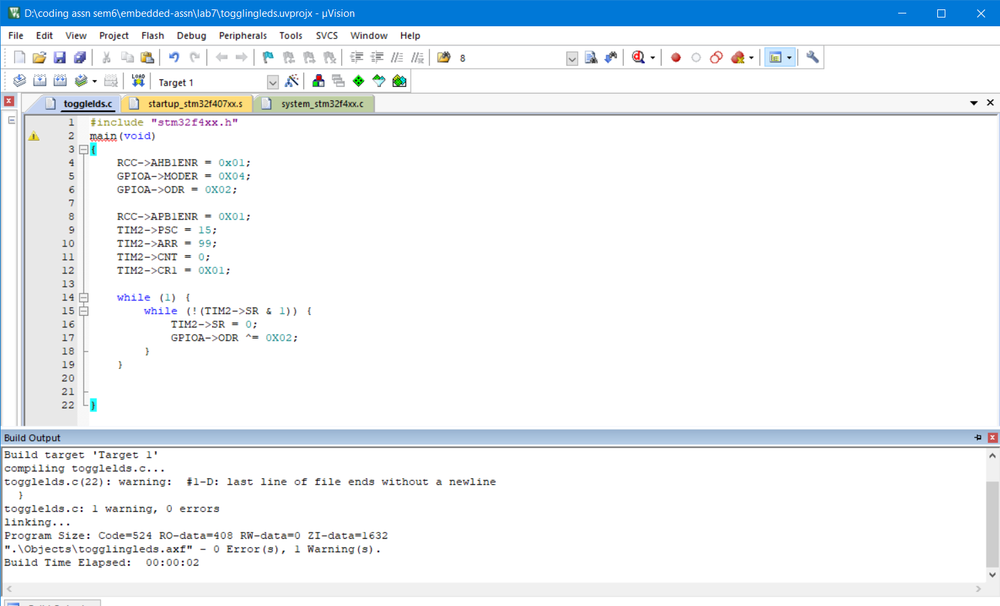
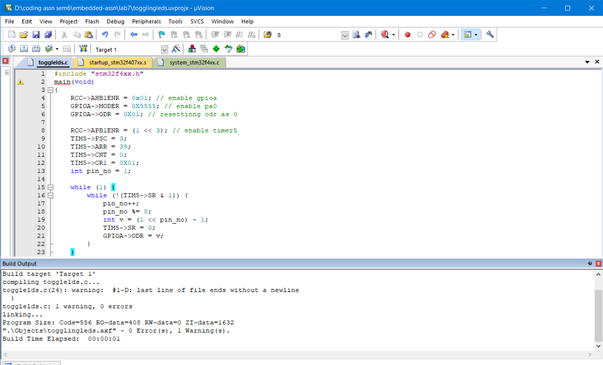

## Nirbhay Sharma (B19CSE114)
## DSL - Lab - 8

---

### **Que-1**

```c
#include "stm32f4xx.h"
main(void)
{
int x,y;
x=0x1B;
RCC->AHB1ENR |= 0x0E; // Enables Clock

if (x >= 0 && x < 100) {
// RCC->AHB1ENR = 0x02;
GPIOB->MODER = 0X15555;
GPIOB->ODR = 0X000;
y = 2 * x  + 2;
GPIOB->ODR = y;
}

if (x >= 100 && x < 200){
// RCC->AHB1ENR = 0x04;
GPIOC->MODER = 0X55555555;
GPIOC->ODR = 0X0000;
y = x * x - 2 * x;
GPIOC->ODR = y;
}

if (x >= 200 && x < 256){
// RCC->AHB1ENR = 0x08;
GPIOD->MODER = 0X5555;
GPIOD->ODR = 0X00;
y = x - 150;
GPIOD->ODR = y;
}

}
```

#### **code-explanation**
- first we are enabling the clock
- then we are applying conditions on x and based on the three conditions we are assigning values to ports
- $(0 \le x < 100)$ first we are setting moder value to (0001 0101 0101 0101 0101) which is $0x15555$ the last 1 is due to overflow since $2x$ can also be 9 bit number if x is 8 bit number. and then the calculated value is send to ODR
- $(100 \le x < 200)$ here the value is $x^2 - 2x$ which can be maximum 16 bits so all the moders of port B is set to output mode
- $(200 \le x < 256)$ here the value is $x - 150$ which is confined to 8 bits only so to support that only $0x5555$ is sufficient and the output is send to odr
- setting the clock to RCC->AHB1ENR=0x02 for port B, 0x04 for port C, 0x08 for port D.

#### **build-output**


### **Que-2**

**Task-2**

```c
#include "stm32f4xx.h"
main(void)
{
    int delay_value = 10;
    SysTick->LOAD = 16000000-1;
    SysTick->VAL = 0;
    for (int i = 0;i<delay_value;i++) {
        SysTick->CTRL = 0x05;
        while (! (SysTick->CTRL & 0x10000) );
    }
}
```

#### **code-explanation**

- first find the load value, it will take which is (Time * Freq - 1) = $16 \times 10^6 \times 1 - 1$ = $15999999$ 
- the above value is for 1s delay so to make it 10 seconds we need to run the loop 10 times
- and hence for loop is there
- we are checking the condition for it to generate an interrupt once it completes the counting and once it completes it breaks the while loop and run again.

#### **build-output**


**Task-3**

```c
#include "stm32f4xx.h"
main(void)
{
    RCC->AHB1ENR = 0X01;
    GPIOA->MODER = 0X5000;
    GPIOA->ODR = 0XC0;
    SysTick->LOAD = 16000000-1;
    SysTick->VAL = 0;
    SysTick->CTRL = 0x05;
    while (1){
        if (SysTick->CTRL & 0x10000){
            GPIOA->ODR ^= 0xc0;
        }
    }
    
}
```

#### **code-explanation**

- here we need to toggle PA6 and PA7 so again we are setting RCC->AHB1ENR to 1 and setting moder = 0x5000 and odr = 0xc0 for the purpose of PA6 and PA7
- and setting the load according to 16MHz freq and 1s delay
- and in while loop we are waiting systick->ctrl register to have countflag 1 and once it is 1 we are toggling the led

#### **build-output**


### **Que-3**

**Task-4**

```c
#include "stm32f4xx.h"
main(void)
{
    RCC->AHB1ENR = 0x01;
    GPIOA->MODER = 0X04;
    GPIOA->ODR = 0X02;

    RCC->APB1ENR = 0X01;
    TIM2->PSC = 15;
    TIM2->ARR = 99;
    TIM2->CNT = 0;
    TIM2->CR1 = 0X01;

    while (1) {
        while (!(TIM2->SR & 1)) {
            TIM2->SR = 0;
            GPIOA->ODR ^= 0X02;
        }
    }
		
	
}
```

#### **code-explanation**

- first enable the GPIOA clock and then set GPIOA->MODER in output mode for pinA1 and glow the led
- then enable tim2 using RCC->APB1ENR and set prescalar and arr value and set count register to 0 and enable the counter using TIM2->CR1
- for prescalar and arr we got the following (input clock freq = 8MHZ) $\frac{8000 KHZ}{(psc+1)(arr+1)} = 5 KHZ$ from this we can get $(psc+1)(arr + 1) = 1600$ and so choosing psc = 15 and arr = 99 accordingly
- and now until a request is pending toggle the led and it will generate a square wave since it will be 1 for sometime and 0 for other time

#### **build-output**




**Task-5**

```c
#include "stm32f4xx.h"
main(void)
{
    RCC->AHB1ENR = 0x01; // enable gpioa
    GPIOA->MODER = 0X5555; // setting 8 pins to output mode
    GPIOA->ODR = 0X01; // resettinng odr as 0

    RCC->APB1ENR = (1 << 3); // enable timer5
    TIM5->PSC = 3;
    TIM5->ARR = 39;
    TIM5->CNT = 0;
    TIM5->CR1 = 0X01;
	int pin_no = 1;

    while (1) {
        while (!(TIM5->SR & 1)) {
            pin_no++;
            pin_no %= 8;
            int v = (1 << pin_no) - 1;
            TIM5->SR = 0;
            GPIOA->ODR = v;
        }
    }
}
```

#### **code-explanation**

- enabling GPIOA clock using rcc->ahb1enr = 0x01
- then to generate a triangular wave we set 8 pins to output mode
- then glow the pin0
- then enable timer 5 using apb1enr
- set prescalar and arr value using the formula (input clock freq = 8MHZ) $\frac{8000 KHZ}{(psc+1)(arr+1)} = 50 KHZ$ from this we can get $(psc+1)(arr + 1) = 160$ and so choosing psc = 3 and arr = 39 accordingly
- take a variable pin_no used for glowing particular pins
- and each time we are increasing the pins for some time and it will generate triangular wave eventually


#### **build-output**




### **Que-4**

```c
#include "stm32f4xx.h"
main(void)
{

	RCC->APB2ENR |= 0X100;
	RCC->AHB1ENR |= 0X01;
	
	ADC1->CR2 |= 0X0402; // ENABLING 10TH AND 2ND BIT OF ADC1 REGISTER
	GPIOA->MODER |= 0X03; // ADC MODE
	
	while (1) {
		ADC1->CR2 |= 0X01;
		ADC1->SQR3 |= 0;
		ADC1->SR = 0;
		ADC1->CR2 |= (1<<30);
		while (!(ADC1->SR & (1<<1)));
		
	}
	

}
```

#### **code-explanation**

- RCC->APB2ENR |= 0X100; means that we are enabling ADC1 by setting ADC1EN to 1
- RCC->AHB1ENR |= 0X01; means that we are enabling clock for gpioA
- ADC1->CR2 |= 0X0402; enabline EOCS (end of conversion selection) and CONT(continuous conversion mode) bit of ADC1 register
- GPIOA->MODER |= 0X03; setting GPIOA P0 in ADC mode (11) 
- ADC1->CR2 |= 0X01; enabling ADC
- adc regular sequence register is set to 0
- ADC1->CR2 |= (1<<30); this will enable SWSTART bit which means that it now starts conversion of regular channels.
- while (!(ADC1->SR & (1<<1))); keep ADC on till we do not get EOC bit as 1 (means we have reached till end of conversion) and break if we reach end of conversion

#### **build-output**


---


<script type="text/javascript" src="http://cdn.mathjax.org/mathjax/latest/MathJax.js?config=TeX-AMS-MML_HTMLorMML"></script>
<script type="text/x-mathjax-config">
    MathJax.Hub.Config({ tex2jax: {inlineMath: [['$', '$']]}, messageStyle: "none" });
</script>