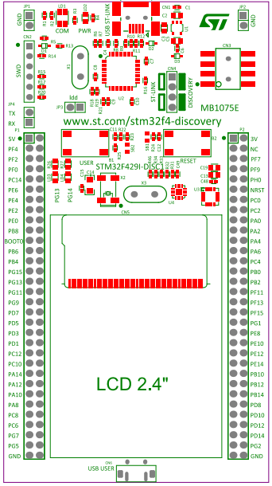

## Nirbhay Sharma (B19CSE114)
## DSL - Lab -9

---

### **diagram for stm board**



## **Task-1**

```c
#include "stm32f4xx.h"
void delay(int dd){
	for (int i = 0;i<dd;i++){
		for (int j = 0;j<300000;j++){
			;
		}
	}
}

main(void)
{

	RCC->AHB1ENR = 0X40; // ENABLING CLOCK FOR PORT G
	GPIOG->MODER = 0X14000000;
	GPIOG->ODR = (1<<13) | (1<<14);
	while (1) {
		GPIOG->ODR = 0X0;
		delay(100);
		GPIOG->ODR = (1<<13) | (1<<14);
		delay(100);
	}

}
```

**logic**

1. first set GPIOG clock using 0x40
2. then set $PG13$, $PG14$ on output mode ($01$) using 0x14000000
3. then set odr to $((1<<13) | (1<<14))$ to enable 13th and 14th pin or glow them.
4. then run a while loop and simply set the values accordingly in order to toggle led's with some delay

## **Task-2**

https://controllerstech.com/pwm-in-stm32/

**part-a**

```c
#include "stm32f4xx.h"
void delay(int dd){
	for (int i = 0;i<dd;i++){
		for (int j = 0;j<300000;j++){
			;
		}
	}
}

main(void)
{

	RCC->AHB1ENR = 0X40; // ENABLING CLOCK FOR PORT G
	GPIOG->MODER = 0X4000000;
	GPIOG->ODR = (1<<13);
	while (1) {
		GPIOG->ODR = 0X0;
		delay(100);
		GPIOG->ODR = (1<<13);
		delay(100);
	}

}
```

**logic**
- the logic is same as above, the difference is that only one led ($PG13$) is glowing here and for that moder is set to $0x4000000$

**part-b**

```c
#include "stm32f4xx.h"
void delay(int dd){
	for (int i = 0;i<dd;i++){
		for (int j = 0;j<300000;j++){
			;
		}
	}
}

main(void)
{

	RCC->AHB1ENR = 0X40; // ENABLING CLOCK FOR PORT G
	GPIOG->MODER = 0X10000000;
	GPIOG->ODR = (1<<14);
	while (1) {
		GPIOG->ODR = 0X0;
		delay(100);
		GPIOG->ODR = (1<<14);
		delay(100);
	}

}
```

**logic**
- the logic is same as above, the difference is that only one led ($PG13$) is glowing here and for that moder is set to $0x10000000$

**part-c**

```c
#include "stm32f4xx.h"
void delay(int dd){
	for (int i = 0;i<dd;i++){
		for (int j = 0;j<300000;j++){
			;
		}
	}
}

main(void)
{

	RCC->AHB1ENR = 0X40; // ENABLING CLOCK FOR PORT G
	GPIOG->MODER = 0X14000000;
	GPIOG->ODR = (1<<13);
	while (1) {
		GPIOG->ODR = (1<<14);
		delay(100);
		GPIOG->ODR = (1<<13);
		delay(100);
	}

}
```

**logic**
- basic logic is same just the difference is that we are now toggling both led's alternatively.

## **Task-3**

```c
#include "stm32f4xx.h"
void delay(int dd){
	for (int i = 0;i<dd;i++){
		for (int j = 0;j<300000;j++){
			;
		}
	}
}

main(void)
{

	RCC->AHB1ENR = 0X41; // ENABLING CLOCK FOR PORT G & A
	GPIOG->MODER = 0X14000000;
	GPIOA->MODER = 0x0;
	
	while (1) {
		if (GPIOA->IDR & 0X01) {
			GPIOG->ODR = (1<<13) | (1<<14);
			while (GPIOA->IDR & 0X01) {
				;
			}
		}
		GPIOA->ODR = 0X0;
		
	}

}
```

**logic**

- for internal led's we need to glow when the push button is pressed and push button is at PA0
- set the RCC->AHB1ENR as 0x41 to enable clock for port G,A
- set Moder for G as 0x14000000
- set Moder for A as 0x00 for making it in input mode
- inside while loop we are waiting for GPIOA->IDR to be 1 since it is 1 when we press it.
- and then if it is 1 then light the led and wait till it is pressed 
- and then make led off once the butten is not pressed

## **Task-4**

```c
#include "stm32f4xx.h"
void delay(int dd){
	for (int i = 0;i<dd;i++){
		for (int j = 0;j<300000;j++){
			;
		}
	}
}

main(void)
{

	RCC->AHB1ENR = 0X41; // ENABLING CLOCK FOR PORT G & A
	GPIOG->MODER = 0X4000000;
	GPIOA->MODER = 0x0;
	
	while (1) {
		if (GPIOA->IDR & 0X01) {
			GPIOG->ODR = (1<<13);
			while (GPIOA->IDR & 0X01) {
				;
			}
		}
		GPIOA->ODR = 0X0;
		
	}

}

```

**logic**
- In this logic we are connecting external led at $PG13$ port and hence logic is to just make that pin high so that 5V voltage is created and light the external led

## **Task-5**

```c
#include "stm32f4xx.h"
void delay(int dd){
	for (int i = 0;i<dd;i++){
		for (int j = 0;j<300000;j++){
			;
		}
	}
}

main(void)
{

	RCC->AHB1ENR = 0X41; // ENABLING CLOCK FOR PORT G & A
	GPIOG->MODER = 0X4000000;
	GPIOA->MODER = 0x0;
	int againon = 0;
	while (1) {
		if (GPIOA->IDR & 0X01) {
			againon = 1-againon;
			if (againon == 1){
				GPIOG->ODR = (1<<13);
			} else {
				GPIOG->ODR = 0x0;
			}
			while (GPIOA->IDR & 0X01);
		}
	}

}

```

**logic**
- in this the external led is connected at $PG13$ only but we are toggling it by pressing button

## **Task-6**
```ino
void setup() {
  // put your setup code here, to run once:
  
  Serial.begin(9600);
}

void loop() {
  // put your main code here, to run repeatedly:
  int aread1 = analogRead(A1);
  delay(1);
  int aread2 = analogRead(A2);

  if (aread2 > aread1){
    Serial.println(aread2);
  } else {
    Serial.println("printing Nothing");
  }
}
```

**logic**
- logic is that read two values from analog A1 and A2 and check if $(a_2 > a_1)$ if it is true then print value read from analog 2

---

<style> 

table, th, td {
  border: 0.1px solid black;
  border-collapse: collapse;
}

</style>

<script type="text/javascript" src="http://cdn.mathjax.org/mathjax/latest/MathJax.js?config=TeX-AMS-MML_HTMLorMML"></script>
<script type="text/x-mathjax-config">
    MathJax.Hub.Config({ tex2jax: {inlineMath: [['$', '$']]}, messageStyle: "none" });
</script>
